<!-- SPDX-License-Identifier: Apache-2.0 -->
# LamaDist

**A secure, maintainable Yocto/OpenEmbedded distribution for homelab devices**

LamaDist provides a hardened Linux distribution built with Yocto Project for homelab infrastructure, featuring comprehensive security (SELinux, dm-verity, LUKS, TPM), Kubernetes orchestration (k3s), and robust OTA updates (RAUC).

## Features

- 🔒 **Multi-layered Security**: SELinux, dm-verity, IMA/EVM, LUKS encryption, secure boot
- 🚀 **Container-ready**: k3s lightweight Kubernetes for orchestrated workloads
- 🔄 **Atomic Updates**: RAUC-based OTA updates with automatic rollback
- 🖥️ **Multi-platform**: Support for x86_64 Intel systems and ARM SBCs (Orin NX, RK1, SOQuartz)
- 📦 **Reproducible Builds**: KAS-based declarative configuration in OCI containers (Podman/Docker)
- 🎯 **Minimal & Optimized**: Lean system with size-optimized builds (`-Os`)

## Quick Start

### Prerequisites

- Linux system (Ubuntu 22.04+ recommended) or WSL2
- [mise](https://mise.jdx.dev/) (polyglot tool manager and task runner)
- [podman](https://podman.io/) or Docker
- 8+ GB RAM, 100+ GB free disk space (SSD recommended)

### Build Your First Image

```bash
# Clone the repository
git clone https://github.com/lamawithonel/lamadist.git
cd lamadist

# Install tools (mise manages everything)
mise install

# Build image (2-6 hours on first build)
mise run build --bsp x86_64

# Images will be in: build/tmp/deploy/images/genericx86-64/
```

### Supported Hardware (BSPs)

- **x86_64**: Intel-based systems (`mise run build --bsp x86_64`)
- **orin-nx**: NVIDIA Jetson Orin NX (`mise run build --bsp orin-nx`)
- **rk1**: Radxa RK1 (`mise run build --bsp rk1`)
- **soquartz**: Pine64 SOQuartz (`mise run build --bsp soquartz`)

## Documentation

Comprehensive documentation is available in the [`docs/`](docs/) directory:

- **[Development Plan](docs/PLAN.md)** - Phased roadmap and project planning
- **[Architecture](docs/ARCHITECTURE.md)** - System architecture and design
- **[Partitioning](docs/PARTITIONING.md)** - Disk partitioning layouts and update strategy
- **[Contributing](docs/CONTRIBUTING.md)** - Contribution guidelines and workflow
- **[Tooling](docs/TOOLING.md)** - Tools, setup, and build system guide

### Key Commands

```bash
mise tasks                     # list available tasks
mise run build --bsp x86_64    # build for x86_64
mise run shell --bsp x86_64    # interactive build environment
mise run dump --bsp x86_64     # dump KAS configuration
mise run version               # show build version
```

See [`docs/TOOLING.md`](docs/TOOLING.md) for detailed usage information.

## Project Status

**Current Phase**: Phase 0 - Architecture Documentation + Tooling Baseline

LamaDist is in active development. See [`docs/PLAN.md`](docs/PLAN.md) for the complete development roadmap.

## Architecture Overview

```mermaid
flowchart TD
    subgraph lamadist["LamaDist System"]
        direction TB
        services["User Services · Containers (k3s) · systemd"]
        security["Security: SELinux · IMA/EVM · dm-verity · LUKS"]
        kernel["Linux Kernel 6.6 LTS"]
        boot["Bootloader (systemd-boot / U-Boot)"]
        hardware["Hardware (x86_64 | ARM64)"]
        services --> security --> kernel --> boot --> hardware
    end
```



See [`docs/ARCHITECTURE.md`](docs/ARCHITECTURE.md) for detailed architecture information.

## Contributing

Contributions are welcome! Please read [`docs/CONTRIBUTING.md`](docs/CONTRIBUTING.md) for:

- Development workflow
- Branch naming and commit message conventions
- Pull request process
- Code review expectations
- Yocto/OE best practices

## Community & Support

- **Issues**: [GitHub Issues](https://github.com/lamawithonel/lamadist/issues)
- **Discussions**: [GitHub Discussions](https://github.com/lamawithonel/lamadist/discussions)
- **Documentation**: [`docs/`](docs/) directory

## Legal Notice

   Copyright 2024-2026 Lucas Yamanishi

   All content licensed under the Apache License, Version 2.0 (the "License");
   you may not use these files except in compliance with the License.
   You may obtain a copy of the License at

       http://www.apache.org/licenses/LICENSE-2.0

   Unless required by applicable law or agreed to in writing, software
   distributed under the License is distributed on an "AS IS" BASIS,
   WITHOUT WARRANTIES OR CONDITIONS OF ANY KIND, either express or implied.
   See the License for the specific language governing permissions and
   limitations under the License.

