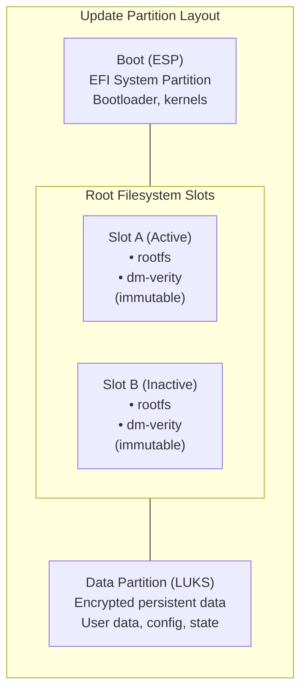

<!-- SPDX-License-Identifier: Apache-2.0 -->
# LamaDist Architecture

This document describes the architecture of the LamaDist distribution, including its components, structure, and design decisions.

## Table of Contents

- [Overview](#overview)
- [System Architecture](#system-architecture)
- [Layer Structure](#layer-structure)
- [Build System Architecture](#build-system-architecture)
- [Target Hardware](#target-hardware)
- [Component Relationships](#component-relationships)
- [Security Architecture](#security-architecture)
- [Update and Maintenance](#update-and-maintenance)

---

## Overview

LamaDist is a Yocto/OpenEmbedded-based Linux distribution designed for homelab devices with a focus on:

- **Security**: Multi-layered security with SELinux, dm-verity, IMA/EVM, LUKS encryption, and secure boot
- **Reliability**: Atomic updates with RAUC, verified boot, and rollback capabilities
- **Containerization**: Kubernetes workloads via k3s lightweight distribution
- **Maintainability**: Reproducible builds, comprehensive testing, and clear documentation

The distribution targets multiple hardware platforms with unified configuration management through KAS (Setup tool for bitbake based projects).

---

## System Architecture

### High-Level Architecture


### Core Components

#### 1. Base System
- **Init System**: systemd (PID 1)
- **System Tools**: systemd ecosystem preferred (systemd-timesyncd, systemd-networkd, systemd-resolved, etc.)
- **Package Format**: RPM with mandatory GPG signatures and TPM-backed signing support
- **File System**: ext4 with dm-verity for integrity
- **Root Filesystem**: Immutable, read-only with verified boot
- **User Space**: Merged `/usr` (UsrMerge)
- **Compression**: zstd level 11 for all compressed artifacts
- **SBOM**: SPDX 3.0.1 software bill of materials for all images

#### 2. Security Stack
- **SELinux**: Mandatory Access Control with targeted policy
- **IMA/EVM**: Integrity Measurement Architecture with Extended Verification Module
- **dm-verity**: Device-mapper integrity checking for root filesystem
- **LUKS**: Encrypted storage for user data
- **TPM 2.0**: Hardware security module support (where available)
- **Secure Boot**: UEFI secure boot on x86_64 systems

#### 3. Container Runtime
- **k3s**: Lightweight Kubernetes distribution for edge/IoT
- **Features**: 
  - Full Kubernetes API compatibility
  - Embedded container runtime (containerd)
  - Built-in networking (Flannel/Calico support)
  - Network policies for pod-to-pod security
  - SELinux support for container isolation
  - Integrated with systemd for service management
- **Storage**: Local path provisioner, supports persistent volumes
- **Networking**: CNI plugins, Kubernetes network policies

**k3s Security Integration:**

k3s integrates with LamaDist's existing security architecture:

- **SELinux Integration**: 
  - k3s containers run under SELinux confinement
  - Container processes inherit SELinux context
  - Pod Security Standards enforcement
  - Mandatory Access Control for container isolation
  - k3s SELinux policy provided by @k3s-io organization
  - **Note**: SELinux is mandatory; AppArmor is NOT used (incompatible with SELinux)
  
- **Network Security**:
  - Kubernetes Network Policies for pod-to-pod communication control
  - Built-in support for encrypted inter-node communication
  - Service mesh compatible (Istio, Linkerd)
  
- **Image Security**:
  - Integration with RPM-signed container images
  - Image pull policies enforcement
  - Private registry support with authentication
  
- **Runtime Security**:
  - Seccomp profiles for syscall filtering
  - Pod Security Admission for security policy enforcement
  - Read-only root filesystems for containers
  - SELinux enforced for all container processes
  
- **Audit and Compliance**:
  - Kubernetes audit logging
  - Integration with IMA/EVM for container image verification
  - RBAC (Role-Based Access Control) for API access
  
- **Resource Isolation**:
  - Control groups (cgroups) for resource limits
  - Namespace isolation for processes, network, and filesystem
  - No privileged containers by default

#### 4. Update System
- **RAUC**: Robust Auto-Update Controller
- **Dual Boot Slots**: A/B partition scheme for atomic updates
- **Rollback**: Automatic rollback on failed updates

---

## Layer Structure

### Yocto/OE Layers

LamaDist is built using multiple Yocto/OpenEmbedded layers organized in a dependency hierarchy:

```
meta-lamadist/                    # Custom distribution layer
├── conf/
│   ├── distro/
│   │   └── lamadist.conf        # Distribution configuration
│   ├── machine/
│   │   └── intel.conf           # Machine-specific configs
│   └── layer.conf               # Layer metadata
├── recipes-core/                # Core system recipes
├── wic/                         # Disk image definitions
└── README.md

External Layers:
├── poky/                        # Yocto Project reference distribution
│   ├── meta/                    # OpenEmbedded-Core
│   ├── meta-poky/               # Poky distribution configuration
│   └── meta-yocto-bsp/          # Reference BSP layer
├── meta-openembedded/           # Extended package repository
│   ├── meta-oe/
│   ├── meta-filesystems/
│   ├── meta-networking/
│   ├── meta-perl/
│   └── meta-python/
├── meta-intel/                  # Intel hardware support
├── meta-clang/                  # Clang/LLVM toolchain
├── meta-secure-core/            # Security features
│   ├── meta-secure-core-common/
│   ├── meta-encrypted-storage/  # LUKS support
│   ├── meta-integrity/          # IMA/EVM support
│   ├── meta-signing-key/        # Key management
│   └── meta-tpm2/               # TPM 2.0 support
├── meta-selinux/                # SELinux support
├── meta-security/               # Security tools and dm-verity
├── meta-virtualization/         # Container runtime support
└── meta-rauc/                   # OTA update system
```

### Layer Purpose and Dependencies

#### meta-lamadist (Custom Layer)
**Purpose**: Define the LamaDist distribution configuration, custom recipes, and integration
**Dependencies**: `core` (from OE-Core)
**Priority**: 50

Key files:
- `conf/distro/lamadist.conf`: Distribution feature set, package management, optimization flags
- `conf/machine/*.conf`: Hardware-specific configurations
- Custom recipes and bbappends

#### Upstream Layers
- **poky**: Base Yocto Project reference with OE-Core
- **meta-openembedded**: Extended recipes for common software
- **meta-intel**: x86_64 hardware support and optimizations
- **meta-clang**: Alternative toolchain support
- **meta-secure-core**: Security framework and features
- **meta-selinux**: SELinux integration
- **meta-security**: Security tools (dm-verity, hardening)
- **meta-virtualization**: Container runtime and orchestration (k3s, containerd)
- **meta-rauc**: Update and recovery system

---

## Build System Architecture

### KAS-Based Build System

LamaDist uses KAS (Setup tool for bitbake based projects) for declarative, reproducible builds.


### Build Container

**Image**: `lamawithonel/lamadist-builder:latest`  
**Base**: Ubuntu 22.04  
**Purpose**: Provide consistent, reproducible build environment

The build container includes:
- All Yocto Project host dependencies
- Python 3.12 with KAS
- Development tools and utilities
- Locale configuration (en_US.UTF-8)

**Non-root builder**: The container runs as user `builder` (UID 1000) for security

### Build Reproducibility

LamaDist implements fully reproducible builds:

- **Deterministic Builds**: All builds produce identical binaries given the same inputs
- **Pinned Dependencies**: All layer versions and external dependencies are pinned
- **Controlled Environment**: Containerized build environment eliminates host variations
- **Source Date Epoch**: Timestamps are normalized for reproducibility
- **SBOM Generation**: Every build produces an SPDX 3.0.1 software bill of materials

### Build Output Standards

All build artifacts follow these standards:

- **Package Format**: RPM format for all packages with mandatory GPG signatures
- **Compression**: zstd algorithm at compression level 11 for optimal balance of size and speed
- **SBOM**: SPDX 3.0.1 format for software bill of materials
- **Signatures**: All packages and images are cryptographically signed (GPG for packages, UEFI for boot artifacts)
- **Hardware-Backed Signing**: TPM 2.0 integration for signing key protection (where available)
- **Manifests**: Complete package lists and dependency information included
- **Verification**: Signature verification enforced at installation time

### KAS Configuration Structure

KAS configurations are organized hierarchically to enable flexible, composable builds:

```
kas/
├── main.kas.yml              # Base configuration (repos, distro)
├── bsp/                      # Board Support Package configs
│   ├── x86_64.kas.yml        # Intel x86_64 machines
│   ├── orin-nx.kas.yml       # NVIDIA Orin NX
│   ├── rk1.kas.yml           # Radxa RK1
│   └── soquartz.kas.yml      # Pine64 SOQuartz
├── extras/                   # Optional feature overlays
│   └── debug.kas.yml         # Debug configuration
├── installer.kas.yml         # USB installer image config
└── scanners/                 # Additional scanner configs
```

**KAS Layering**: Configurations are combined using `:` separator:
```bash
kas build main.kas.yml:bsp/x86_64.kas.yml:extras/debug.kas.yml
```

### mise Tasks

The `mise` task runner provides convenient tasks for common operations (replacing the root `Makefile`):

#### Build Tasks
- `mise run build --bsp <bsp>`: Build images for specified BSP (default: x86_64)
- `mise run ci-build`: Build with CI-specific settings (force checkout, update)
- `mise run container`: Build the KAS build container

#### Development Tasks
- `mise run shell --bsp <bsp>`: Start interactive shell in KAS environment
- `mise run container-shell`: Start shell in build container (without KAS)
- `mise run dump --bsp <bsp>`: Dump KAS configuration

#### Cleanup Tasks
- `mise run clean`: Remove build artifacts
- `mise run clean:all`: Remove entire build directory (with confirmation)
- `mise run clean:sstate`: Clean shared state cache
- `mise run clean:container`: Remove container image

#### Utility Tasks
- `mise run version`: Display build version (via GitVersion)
- `mise tasks`: List all available tasks

### Build Caching

**Shared State (sstate) Cache**: Reusable build artifacts stored in `.cache/sstate/`
- Speeds up subsequent builds
- Shared across BSPs where possible
- Can be configured to use remote mirrors

**Download Directory**: Source tarballs cached in `build/downloads/`

---

## Target Hardware

LamaDist supports multiple hardware platforms:

### x86_64 Intel Systems

**Machine**: `genericx86-64` (with Intel optimizations available)  
**Bootloader**: UKI direct boot (UEFI) or systemd-boot (fallback)  
**Boot Integrity**: Full suite (Secure Boot + Measured Boot + Trusted Boot)  
**Features**:
- UEFI boot
- UKI (Unified Kernel Image) with direct boot support
- TPM 2.0 support for Measured Boot
- UEFI Secure Boot with signed binaries
- Trusted Boot with IMA/EVM integration
- Intel microcode updates
- dm-verity root filesystem verification

**Use Cases**: Home servers, NAS, compute nodes

### ARM64 Platforms

#### NVIDIA Jetson Orin NX
**Machine**: `orin-nx` (Tegra platform)  
**Bootloader**: U-Boot / UEFI  
**Features**:
- ARM Cortex-A78AE cores
- GPU acceleration
- High-performance AI/ML workloads

#### Radxa RK1
**Machine**: `rk1` (Rockchip RK3588)  
**Features**:
- ARM Cortex-A76/A55 cores
- Mali GPU
- PCIe, NVMe, SATA support

#### Pine64 SOQuartz
**Machine**: `soquartz` (Rockchip RK3566)  
**Features**:
- Raspberry Pi CM4 form factor
- Low power consumption
- Embedded applications

---

## Component Relationships

### Build-Time Dependencies


### Runtime Dependencies


### Host Configuration

LamaDist uses kernel command line arguments for host-specific configuration, maintaining immutability of the root filesystem:

**Configuration via Kernel Command Line:**

- **hostname**: System hostname passed as `systemd.hostname=myhost`
- **machine-id**: Unique machine identifier via `systemd.machine_id=<uuid>`
- **Network Settings**: Network configuration via kernel parameters
  - IP address, gateway, DNS via `ip=` parameter
  - Network interface configuration
  
**Benefits of Kernel Command Line Configuration:**

- **Immutable Root**: No need to modify root filesystem for host-specific settings
- **Early Configuration**: Settings available before root filesystem mount
- **Secure**: Configuration is part of the signed boot chain
- **Flexible**: Different hosts can use the same root filesystem image
- **Auditable**: Configuration changes are visible in boot parameters

**Example Boot Configuration:**

```
linux /vmlinuz root=/dev/mapper/root-A ro \
  systemd.hostname=homelab01 \
  systemd.machine_id=a1b2c3d4e5f6... \
  ip=192.168.1.100::192.168.1.1:255.255.255.0:homelab01:eth0:none
```

---

## Security Architecture

LamaDist implements defense-in-depth with multiple security layers:

### 1. Boot Integrity Protection

LamaDist employs comprehensive boot integrity protection using the fullest set of features available on each platform:

**Boot Integrity Technologies:**

- **Secure Boot**: Cryptographic verification of boot components
  - UEFI Secure Boot on x86_64 systems
  - Signed boot binaries on supported platforms
  - Chain of trust from firmware through kernel
  - Prevents execution of unsigned/tampered boot code
  
- **Measured Boot**: Hardware-based boot measurement and attestation
  - TPM PCR (Platform Configuration Register) measurements
  - Boot components measured into TPM before execution
  - Creates cryptographic log of boot process
  - Enables remote attestation of system state
  - Available on systems with TPM 1.2 or TPM 2.0
  
- **Trusted Boot**: Extended boot integrity verification
  - Kernel and initramfs integrity verification
  - IMA (Integrity Measurement Architecture) integration
  - Boot-time policy enforcement
  - Extends trust chain into runtime
  
**Platform-Specific Implementation:**

- **x86_64 UEFI Systems**:
  - UEFI Secure Boot (signature verification)
  - TPM 2.0 Measured Boot (PCR measurements)
  - UKI with embedded signatures
  - IMA/EVM for runtime integrity
  
- **ARM64 Systems**:
  - Platform-specific secure boot mechanisms
  - Trusted Boot where available
  - Hardware-backed key storage
  - Boot integrity verification per platform capabilities
  
**Defense in Depth Approach:**

The boot integrity protection is layered:
1. **Firmware verification**: Hardware root of trust validates firmware
2. **Secure Boot**: Firmware validates bootloader/UKI signatures
3. **Measured Boot**: TPM records measurements of all boot components
4. **Trusted Boot**: Kernel validates initramfs and early boot components
5. **Runtime integrity**: IMA/EVM extends integrity verification to all files

**Implementation Strategy:**

LamaDist configures the fullest set of boot integrity protection available:
- Platforms supporting all features: Enable Secure Boot + Measured Boot + Trusted Boot
- Platforms with partial support: Enable maximum available subset
- All platforms: Implement software-based integrity verification (dm-verity, IMA/EVM)

### 2. Secure Boot Chain

**With UKI Direct Boot (preferred on UEFI systems):**


**With Traditional Bootloader (fallback or non-UKI systems):**


**Unified Kernel Image (UKI):**

On systems that support it (x86_64 UEFI), boot artifacts are packaged into a UKI executable:

- **Components**: Kernel, initramfs, kernel command line, and optionally splash screen bundled into a single PE executable
- **Boot Method**: UKI is booted directly by UEFI firmware, bypassing traditional bootloader
- **Benefits**:
  - Single signed artifact simplifies secure boot
  - Prevents tampering with kernel command line
  - Atomic boot artifact (all-or-nothing verification)
  - Eliminates bootloader as potential attack surface
  - Faster boot time (one less stage)
  - Simplified boot configuration
- **Implementation**: Generated using systemd-ukify or similar tooling
- **Verification**: Entire UKI signed and verified by UEFI secure boot
- **Fallback**: systemd-boot can be used as bootloader when direct boot is not supported

### 3. File System Integrity

- **dm-verity**: Hash-tree based integrity verification of root filesystem
  - Read-only root with cryptographic verification
  - Detects any tampering or corruption
  - Integrated with initramfs for early verification

- **IMA/EVM**: File-level integrity measurement
  - Extended attributes store signatures
  - Measures files at access time
  - Detects unauthorized modifications

### 4. Mandatory Access Control

- **SELinux**: Kernel-level MAC (Mandatory Access Control)
  - Targeted policy (refpolicy-targeted)
  - First-boot automatic relabeling
  - Enforces security boundaries between processes
  - **Exclusive MAC**: SELinux is the only supported MAC framework (AppArmor is incompatible and MUST NOT be used)

### 5. Storage Encryption

- **LUKS**: Full disk encryption for data partitions
  - AES-256 encryption
  - TPM-sealed keys (where available)
  - Protects data at rest

### 6. Package Signing

- **RPM Package Format**: All packages use RPM format with mandatory signatures
  - GPG-signed RPM packages
  - Signature verification on installation
  - Chain of trust from build to deployment
  
- **Hardware Root of Trust Integration**:
  - Package signing keys can be stored in TPM 2.0 (where available)
  - TPM-backed signing provides hardware-protected key storage
  - Verification keys distributed securely
  - Integration with secure boot chain
  
- **Package Verification Process**:
  - RPM database verifies signatures before installation
  - IMA/EVM verifies package integrity at runtime
  - SELinux enforces package context policies
  - Complete audit trail of package provenance

---

## Update and Maintenance

### OTA Update System (RAUC)

LamaDist uses RAUC (Robust Auto-Update Controller) for safe, atomic updates:



**Key Partition Features:**

- **Boot (ESP)**: UEFI system partition with bootloader and kernel images
- **Slot A/B**: Immutable, read-only root filesystems with dm-verity integrity checking
- **Data Partition**: LUKS-encrypted volume for all persistent, mutable data
- **Immutability**: Root filesystems cannot be modified at runtime
- **Encryption**: All persistent user data is encrypted with LUKS

### Update Process

1. **Download**: Update bundle downloaded (signed RAUC bundle)
2. **Verification**: Bundle signature verified
3. **Installation**: Update installed to inactive slot
4. **Activation**: Bootloader configured to boot from new slot
5. **Reboot**: System reboots into updated slot
6. **Verification**: System health checks run
7. **Commit**: Update marked good, or automatic rollback on failure

### Rollback Mechanism

- Automatic rollback on boot failure (bootloader retry count)
- Automatic rollback on health check failure
- Manual rollback via RAUC commands
- Previous slot always preserved until next update

---

## Design Principles

### 1. Security First
- Multiple overlapping security mechanisms
- Principle of least privilege
- Minimal attack surface
- Regular security updates
- **SELinux mandatory**: System MUST use SELinux for MAC; AppArmor is NOT supported (incompatible)

### 2. Reliability
- Verified boot chain
- Atomic updates with rollback
- Immutable root filesystem
- Comprehensive error handling
- Encrypted persistent data storage

### 3. Reproducibility
- Fully deterministic builds
- Declarative configuration (KAS YAML)
- Pinned dependencies
- Containerized build environment
- Version-controlled everything
- SPDX 3.0.1 SBOM for all artifacts

### 4. Maintainability
- Clear documentation
- Modular architecture
- Standard tools and practices
- Automated testing
- Comprehensive build provenance

### 5. Performance
- Optimized compiler flags (`-Os`)
- Minimal installed packages
- Efficient init system (systemd)
- Hardware-specific optimizations
- zstd level 11 compression for optimal size/speed balance

### 6. Consistency and Integration
- systemd-first approach: Prefer systemd ecosystem tools for system management
- Examples: systemd-timesyncd (time sync), systemd-networkd (networking), systemd-resolved (DNS)
- Rationale: Tight integration, consistent configuration, reduced dependencies
- Exceptions: Use alternatives only when systemd tools cannot meet specific requirements

---

## Future Architecture Considerations

### Planned Enhancements
- **Cloud Integration**: Metrics, logging, remote management
- **Clustering**: Multi-node orchestration
- **Advanced Networking**: SR-IOV, DPDK support
- **eBPF**: Advanced observability and security

### Scalability
- Support for additional hardware platforms
- Expanded BSP coverage
- Custom board support

---

## References

- [Yocto Project Documentation](https://docs.yoctoproject.org/)
- [KAS Documentation](https://kas.readthedocs.io/)
- [RAUC Documentation](https://rauc.readthedocs.io/)
- [SELinux Project](https://github.com/SELinuxProject)
- [dm-verity](https://www.kernel.org/doc/html/latest/admin-guide/device-mapper/verity.html)
- [systemd Documentation](https://www.freedesktop.org/wiki/Software/systemd/)
- [Unified Kernel Image (UKI)](https://uapi-group.org/specifications/specs/unified_kernel_image/)
- [systemd-boot](https://www.freedesktop.org/software/systemd/man/systemd-boot.html)

---

**Last Updated:** 2026  
**Document Version:** 2.0
