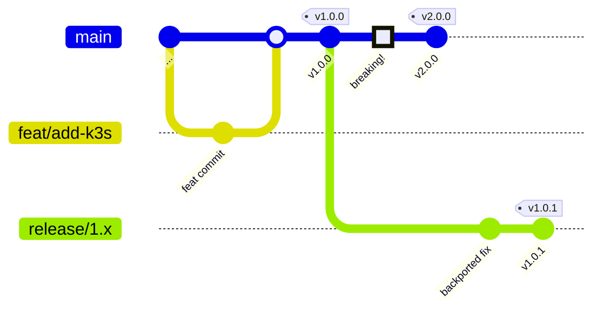

<!-- SPDX-License-Identifier: Apache-2.0 -->
# Contributing to LamaDist

Thank you for your interest in contributing to LamaDist! This document provides guidelines and instructions for contributing to the project.

## Table of Contents

- [Code of Conduct](#code-of-conduct)
- [Getting Started](#getting-started)
- [Development Workflow](#development-workflow)
- [Branching Strategy (JIT Flow)](#branching-strategy-jit-flow)
- [Commit Message Standards](#commit-message-standards)
- [Pull Request Process](#pull-request-process)
- [Code Review Expectations](#code-review-expectations)
- [Yocto/OE Best Practices](#yoctooe-best-practices)
- [Testing Requirements](#testing-requirements)
- [Documentation](#documentation)

---

## Code of Conduct

This project follows a code of conduct that we expect all contributors to adhere to:

- **Be respectful**: Treat all contributors with respect and consideration
- **Be collaborative**: Work together and help each other
- **Be inclusive**: Welcome contributors of all backgrounds and skill levels
- **Be constructive**: Provide helpful feedback and be open to receiving it
- **Be patient**: Remember that everyone is learning and improving

---

## Getting Started

### Prerequisites

Before contributing, ensure you have:

1. **Development Environment**: Linux system (Ubuntu 22.04 recommended) or WSL2
2. **mise**: Polyglot tool manager and task runner ([mise.jdx.dev](https://mise.jdx.dev/))
3. **podman** (preferred) or Docker: For containerized builds
4. **Git**: Version control
5. **Basic Knowledge**: Familiarity with Yocto/OE, Linux, and Git

See [TOOLING.md](TOOLING.md) for detailed setup instructions.

### Setting Up Your Development Environment

1. **Fork the Repository**
   ```bash
   # Fork lamawithonel/lamadist on GitHub
   # Then clone your fork
   git clone https://github.com/YOUR_USERNAME/lamadist.git
   cd lamadist
   ```

2. **Add Upstream Remote**
   ```bash
   git remote add upstream https://github.com/lamawithonel/lamadist.git
   git fetch upstream
   ```

3. **Install Development Tools**
   ```bash
   # mise manages all tooling — no Python, venv, or Make needed on the host
   mise install
   ```

4. **Build the Container**
   ```bash
   mise run container
   ```

5. **Verify Setup**
   ```bash
   # Try building for default BSP (x86_64)
   mise run build --bsp x86_64
   ```

---

## Development Workflow

### 1. Create a Feature Branch

Always work on a feature branch, never directly on `main`:

```bash
# Update your local main branch
git checkout main
git pull upstream main

# Create and checkout a new feature branch
git checkout -b feat/your-feature-name
```

### 2. Make Your Changes

- Make focused, logical changes
- Follow Yocto/OE best practices (see below)
- Test your changes locally
- Update documentation if needed

### 3. Commit Your Changes

```bash
# Stage your changes
git add <files>

# Commit with a descriptive message (scope is strongly encouraged)
git commit -m "feat(recipe): add custom monitoring service

Add a new systemd service that monitors system health.

Ticket: LAMA-42
See: https://example.com/monitoring-design"
```

See [Commit Message Standards](#commit-message-standards) below.

### 4. Keep Your Branch Updated

```bash
# Fetch upstream changes
git fetch upstream

# Rebase your branch on upstream/main
git rebase upstream/main

# Or merge if rebasing is problematic
git merge upstream/main
```

### 5. Push to Your Fork

```bash
git push origin feat/your-feature-name
```

### 6. Open a Pull Request

- Go to the GitHub repository
- Click "New Pull Request"
- Select your fork and branch
- Fill out the PR template (see [`.github/PULL_REQUEST_TEMPLATE.md`](../.github/PULL_REQUEST_TEMPLATE.md))
- Link any related issues

---

## Branching Strategy (JIT Flow)

LamaDist uses **JIT Flow** — a lightweight branching strategy built around Conventional Commit type prefixes and linear history on `main`.

### Feature Branches

Feature branches branch off `main` using the pattern:

```
<type>/<short-description>
```

Where `<type>` is any [Conventional Commit](#commit-message-standards) type prefix:

- `feat/` — New features or enhancements
- `fix/` — Bug fixes
- `docs/` — Documentation changes
- `refactor/` — Code refactoring
- `test/` — Adding or updating tests
- `chore/` — Maintenance tasks, build changes
- `ci/` — CI/CD changes
- `build/` — Build system changes
- `perf/` — Performance improvements
- `security/` — Security fixes or improvements

Feature branches merge back into `main` via Pull Request.

### Releases and Tags

- **Tags on `main`** create releases
- **Latest stable version** = latest tag on `main`
- **Latest unstable** = HEAD of `main`

### Breaking Changes and Release Branches

When a **breaking change** is introduced on `main`, the commit **prior** to the breaking change is forked into a new release branch:

```
release/<major>[.minor][-codename]
```

- Non-breaking changes may be backported to `release/` branches
- Prefer `release/<major>.<minor>` format for branches receiving only important fix backports
- Subsequent releases for a `release/` branch are tagged on that branch

### JIT Flow Diagram



### Branch Naming Examples

```
feat/add-k3s-support
fix/systemd-boot-timeout
docs/update-architecture
refactor/kas-config-structure
test/add-image-boot-tests
chore/update-dependencies
ci/add-build-matrix
build/migrate-to-mise
perf/optimize-sstate-cache
security/patch-cve-2024-1234
```

### Branch Naming Guidelines

- Use lowercase letters
- Use hyphens to separate words (not underscores or spaces)
- Keep names concise but descriptive
- Include issue number if applicable: `fix/123-boot-failure`

---

## Commit Message Standards

We follow the [Conventional Commits](https://www.conventionalcommits.org/) specification. The `[optional scope]` is **strongly encouraged**.

### Format

```
<type>[optional scope]: <description>

[optional body]

[optional footer(s) / git trailers]
```

### Types

- `feat`: New feature
- `fix`: Bug fix
- `docs`: Documentation changes
- `style`: Code style changes (formatting, no functional change)
- `refactor`: Code refactoring
- `perf`: Performance improvements
- `test`: Adding or updating tests
- `build`: Build system or dependency changes
- `ci`: CI/CD changes
- `chore`: Other changes that don't modify src or test files
- `revert`: Revert a previous commit
- `security`: Security fix or improvement

### Scope (Strongly Encouraged)

Specify the area affected by the change:

- `kas`: KAS configuration changes
- `meta`: Meta-layer changes
- `distro`: Distribution configuration
- `machine`: Machine configuration
- `recipe`: Recipe changes
- `container`: Container/build environment changes
- `docs`: Documentation
- `tooling`: Build tooling (mise, podman, etc.)

### Git Trailers

Use [git trailers](https://git-scm.com/docs/git-interpret-trailers) in the footer section of your commit messages to provide structured metadata:

| Trailer | Purpose | Example |
|---------|---------|---------|
| `See:` | Reference related resources | `See: https://docs.yoctoproject.org/...` |
| `Ticket:` | Link to external tracker (optional) | `Ticket: LAMA-42` |
| `Fixes:` | Close an issue with this commit | `Fixes: #156` |
| `Closes:` | Close a PR or issue | `Closes: #42` |
| `CVE:` | Reference a CVE identifier | `CVE: CVE-2024-1234` |
| `Signed-off-by:` | Developer Certificate of Origin | `Signed-off-by: Name <email>` |
| `Co-authored-by:` | Credit co-authors | `Co-authored-by: Name <email>` |

### Examples

Good commit messages:

```
feat(recipe): add custom systemd service for monitoring

Add a new systemd service that monitors system health and reports
metrics. The service runs every 5 minutes and logs to journald.

Closes: #42
Signed-off-by: Jane Doe <jane@example.com>
```

```
fix(kas): correct layer dependency order

The meta-security layer must come before meta-virtualization to
avoid conflicting package versions.

Fixes: #156
See: https://docs.yoctoproject.org/dev/dev-manual/layers.html
```

```
docs(architecture): update security architecture section

Add detailed explanation of dm-verity integration and how it
interacts with the initramfs boot process.

Ticket: LAMA-99
```

```
security(distro): update kernel to address CVE-2024-1234

Backport security patches for CVE-2024-1234.

CVE: CVE-2024-1234
Signed-off-by: Jane Doe <jane@example.com>
```

Bad commit messages:

```
❌ updated stuff
❌ fix
❌ WIP
❌ asdfasdf
❌ minor changes
```

### Commit Message Guidelines

- **First line**: 50 characters or less, imperative mood ("add" not "added" or "adds")
- **Scope**: Strongly encouraged — specify the component affected
- **Body**: Wrap at 72 characters, explain what and why (not how)
- **Footer**: Use git trailers for references, issues, CVEs, and sign-offs
- **Sign-off**: Use `git commit -s` to sign off on commits (DCO)

---

## Pull Request Process

### Before Submitting

- [ ] Code follows Yocto/OE best practices
- [ ] All commits have clear, descriptive messages with scopes
- [ ] Branch is up to date with `upstream/main`
- [ ] Changes have been tested locally
- [ ] Documentation has been updated
- [ ] No sensitive information (keys, passwords) in commits
- [ ] Commit messages follow Conventional Commits with git trailers

### PR Template

Use the PR template at [`.github/PULL_REQUEST_TEMPLATE.md`](../.github/PULL_REQUEST_TEMPLATE.md) when opening a pull request. The template is automatically loaded by GitHub.

### PR Size Guidelines

- **Small PRs are preferred**: Easier to review, test, and merge
- **One logical change per PR**: Don't mix unrelated changes
- **Large changes**: Break into multiple PRs if possible
- **Justification**: If PR is large, explain why in description

### PR Labels

Maintainers will add labels to categorize PRs:

- `bug` - Bug fixes
- `enhancement` - New features
- `documentation` - Documentation changes
- `security` - Security-related
- `needs-review` - Awaiting review
- `work-in-progress` - Not ready for merge
- `blocked` - Blocked by another issue/PR

---

## Code Review Expectations

### For Authors

- **Respond promptly**: Address review comments in a timely manner
- **Be open to feedback**: Reviewers are trying to improve the code
- **Ask questions**: If you don't understand a comment, ask for clarification
- **Don't take it personally**: Reviews are about the code, not you
- **Push updates**: After addressing comments, push updates and respond

### For Reviewers

- **Be constructive**: Explain the "why" behind suggestions
- **Be specific**: Point to exact lines and provide examples
- **Be timely**: Review PRs within a reasonable time frame
- **Approve or request changes**: Make your intent clear
- **Test changes**: If possible, test the changes locally

### Review Criteria

Reviewers will check for:

- **Correctness**: Does the code do what it's supposed to?
- **Quality**: Is the code clean, readable, and maintainable?
- **Testing**: Are changes adequately tested?
- **Documentation**: Is documentation updated?
- **Best practices**: Does it follow Yocto/OE conventions?
- **Security**: Are there any security concerns?
- **Performance**: Any performance implications?

---

## Yocto/OE Best Practices

### Recipe Writing

1. **Use SPDX License Identifiers**
   ```bitbake
   # SPDX-License-Identifier: MIT
   ```

2. **Include Clear License Information**
   ```bitbake
   LICENSE = "MIT"
   LIC_FILES_CHKSUM = "file://LICENSE;md5=..."
   ```

3. **Use Appropriate Recipe Style**
   ```bitbake
   SUMMARY = "Brief one-line description"
   DESCRIPTION = "Longer, more detailed description of the package"
   HOMEPAGE = "https://project.homepage.com"
   SECTION = "devel"
   ```

4. **Proper Variable Ordering**
   - License information first
   - SRC_URI and checksums
   - Dependencies (DEPENDS, RDEPENDS)
   - Build configuration (inherit, EXTRA_OECONF, etc.)
   - Install tasks
   - Package configuration

5. **Use bbappends Appropriately**
   - Place in your layer, not upstream layers
   - Keep minimal and focused
   - Document why the append is needed

### KAS Configuration

1. **Keep configs modular**: Base configs + BSP overlays + feature overlays
2. **Document overrides**: Comment complex configurations
3. **Pin versions**: Specify branches/tags for reproducibility
4. **Use proper YAML syntax**: Valid YAML with clear structure

### Layer Management

1. **Layer dependencies**: Declare all dependencies in `layer.conf`
2. **Layer priority**: Set appropriate `BBFILE_PRIORITY`
3. **Layer compatibility**: Update `LAYERSERIES_COMPAT` for each release
4. **Layer README**: Maintain comprehensive layer documentation

---

## Testing Requirements

### Local Testing

Before submitting a PR, test your changes:

```bash
# Build for your target BSP
mise run build --bsp x86_64

# Test in QEMU (if applicable)
runqemu nographic

# Check for warnings/errors in build logs
```

### Build Testing

- Ensure clean builds from scratch
- Test with and without sstate cache
- Verify no new warnings introduced

### Image Testing

If you've modified images or core recipes:

- Boot test on target hardware (if available)
- Verify key functionality works
- Test upgrade path (if modifying update system)

### Documentation Testing

If you've modified documentation:

- Ensure Markdown is properly formatted
- Verify links work
- Check for typos/grammar issues

---

## Documentation

### When to Update Documentation

Update documentation when you:

- Add new features
- Change existing behavior
- Add new configuration options
- Fix bugs that weren't obvious
- Add new tools or dependencies

### Documentation Types

- **README.md**: Quick start and overview
- **docs/PLAN.md**: Development roadmap
- **docs/ARCHITECTURE.md**: System architecture
- **docs/TOOLING.md**: Tools and setup
- **docs/CONTRIBUTING.md**: This file
- **Recipe comments**: Inline documentation in recipes
- **Commit messages**: Detailed explanations

### Documentation Standards

- Use clear, concise language
- Include examples where helpful
- Keep formatting consistent
- Update table of contents when adding sections
- Include SPDX license headers

---

## Getting Help

If you need help:

- **Documentation**: Check docs/ directory first
- **Issues**: Search existing issues on GitHub
- **Discussions**: Start a discussion on GitHub Discussions
- **Maintainers**: Tag maintainers in issues/PRs for specific questions

---

## License

By contributing to LamaDist, you agree that your contributions will be licensed under the Apache License 2.0, consistent with the project's existing license.

All contributions must include the SPDX license identifier:
```
# SPDX-License-Identifier: Apache-2.0
```

---

## Recognition

Contributors will be recognized in:
- Git commit history
- Release notes
- Project documentation (if significant contribution)

Thank you for contributing to LamaDist!

> **Note:** For the last modification date of any document, consult the Git commit history: `git log --format='%ai' -1 -- <filepath>`

