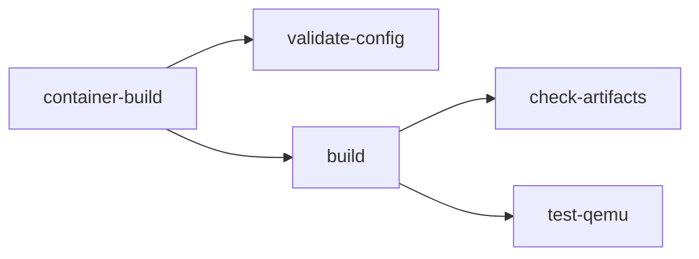

<!-- SPDX-License-Identifier: Apache-2.0 -->
# GitHub Actions Self-Hosted Runner Setup

This document describes how to set up a GitHub Actions self-hosted runner for
LamaDist CI.

## Table of Contents

- [Workflow Overview](#workflow-overview)
- [Workflow File](#workflow-file)
- [Self-Hosted Runner Setup](#self-hosted-runner-setup)
  - [Host Requirements](#host-requirements)
  - [Runner Installation with Podman Quadlet](#runner-installation-with-podman-quadlet)
  - [Alternative: Direct Runner Installation](#alternative-direct-runner-installation)

---

## Workflow Overview

LamaDist uses GitHub Actions for continuous integration.  Due to the
resource-intensive nature of Yocto builds (large disk, RAM, and build time),
the CI pipeline requires a **self-hosted runner** for build and test jobs.

The CI workflow is defined in `.github/workflows/ci.yml` and consists of these
jobs:



1. **container-build** — Build the build container image
2. **validate-config** — Validate KAS configuration via `kas dump`
3. **build** — Full distribution build via `mise run ci-build`
4. **check-artifacts** — Validate build output (WIC image, kernel)
5. **test-qemu** — Boot the image in QEMU and verify login prompt

## Workflow File

Create `.github/workflows/ci.yml` with the following content:

```yaml
---
name: CI

on:
  push:
    branches: [main]
  pull_request:
    branches: [main]
  workflow_dispatch:

permissions:
  contents: read

concurrency:
  group: ci-${{ github.ref }}
  cancel-in-progress: ${{ github.event_name == 'pull_request' }}

jobs:
  container-build:
    name: Build Container
    runs-on: [self-hosted, linux, lamadist]
    timeout-minutes: 30
    steps:
      - name: Checkout
        uses: actions/checkout@v4

      - name: Install mise
        uses: jdx/mise-action@v2

      - name: Build container image
        run: mise run container

  validate-config:
    name: Validate KAS Config
    needs: container-build
    runs-on: [self-hosted, linux, lamadist]
    timeout-minutes: 10
    steps:
      - name: Checkout
        uses: actions/checkout@v4

      - name: Install mise
        uses: jdx/mise-action@v2

      - name: Validate configuration
        run: mise run ci-validate-config

  build:
    name: Build Distribution
    needs: container-build
    runs-on: [self-hosted, linux, lamadist]
    timeout-minutes: 480
    steps:
      - name: Checkout
        uses: actions/checkout@v4

      - name: Install mise
        uses: jdx/mise-action@v2

      - name: Build
        run: mise run ci-build

      - name: Upload artifacts
        uses: actions/upload-artifact@v4
        with:
          name: build-artifacts-${{ github.sha }}
          path: build/tmp/deploy/images/
          retention-days: 7

  check-artifacts:
    name: Validate Artifacts
    needs: build
    runs-on: [self-hosted, linux, lamadist]
    timeout-minutes: 10
    steps:
      - name: Checkout
        uses: actions/checkout@v4

      - name: Download artifacts
        uses: actions/download-artifact@v4
        with:
          name: build-artifacts-${{ github.sha }}
          path: build/tmp/deploy/images/

      - name: Install mise
        uses: jdx/mise-action@v2

      - name: Validate artifacts
        run: mise run ci-check-artifacts

  test-qemu:
    name: QEMU Boot Test
    needs: build
    runs-on: [self-hosted, linux, lamadist]
    timeout-minutes: 15
    steps:
      - name: Checkout
        uses: actions/checkout@v4

      - name: Download artifacts
        uses: actions/download-artifact@v4
        with:
          name: build-artifacts-${{ github.sha }}
          path: build/tmp/deploy/images/

      - name: Install mise
        uses: jdx/mise-action@v2

      - name: QEMU boot test
        run: mise run ci-test-qemu
```

## Self-Hosted Runner Setup

GitHub-hosted runners lack sufficient resources for Yocto builds.  A self-hosted
runner is required with the following specifications.

### Host Requirements

| Resource | Minimum | Recommended |
|----------|---------|-------------|
| CPU      | 4 cores | 8+ cores    |
| RAM      | 16 GB   | 32+ GB      |
| Disk     | 100 GB free | 200+ GB SSD |
| OS       | Linux (x86_64) | Fedora 40+, Ubuntu 24.04+ |

Required host packages:

- `podman` ≥ 4.4 (Quadlet support)
- `qemu-system-x86_64` and `qemu-img`
- `git`
- `curl`
- `container-selinux` (if SELinux is enforcing)

### Runner Installation with Podman Quadlet

The self-hosted runner is managed as a native systemd service using a
[Podman Quadlet](https://docs.podman.io/en/latest/markdown/podman-systemd.unit.5.html)
`.container` unit.  Quadlet translates a declarative `.container` file into a
full systemd service — no hand-written `ExecStart` is needed.

#### 1. Create a system service user

Use a **system** user with no login shell.  The home directory is placed under
`/var/lib` to keep service state out of `/home`.  A single `github-runner`
user can host multiple runner containers (one per repository) by using
per-repo Quadlet files and work directories.

> **Why not `/dev/null` as the home directory?**
> A system user's home set to `/dev/null` would prevent Podman from storing
> per-user container data (images, layers, `libpod` state) under
> `$HOME/.local/share/containers`.  Rootless Podman requires a real, writable
> home directory for its storage backend.  `/var/lib/github-runner` satisfies
> this requirement while keeping state out of `/home`.

```sh
sudo useradd \
  --system \
  --home-dir /var/lib/github-runner \
  --create-home \
  --shell /usr/sbin/nologin \
  github-runner;
```

#### 2. Provision `subuid`/`subgid` ranges

Rootless Podman requires subordinate UID/GID mappings for the service user.
This is a one-time step — the ranges are shared across all runner containers:

```sh
sudo usermod --add-subuids 200000-265535 github-runner;
sudo usermod --add-subgids 200000-265535 github-runner;
```

#### 3. Create host directories

Create per-repo work directories and a shared tool cache.  The work directory
lives under the service user's home at `~/work/<repo>`:

```sh
sudo install -d -o github-runner -g github-runner -m 0750 \
  /var/lib/github-runner/work/lamadist;
sudo install -d -o github-runner -g github-runner -m 0750 \
  /var/cache/github-runner;
```

#### 4. Write the Quadlet `.container` unit

Save as `/etc/containers/systemd/github-runner-lamadist.container`.  Each
repository gets its own `.container` file — the `-lamadist` suffix namespaces
this runner.  Quadlet generates `github-runner-lamadist.service` from the
filename automatically.

```ini
# /etc/containers/systemd/github-runner-lamadist.container
# Podman Quadlet unit for GitHub Actions self-hosted runner (LamaDist).
#
# After editing, reload with:
#   sudo systemctl daemon-reload
#
# Quadlet generates github-runner-lamadist.service from this file.
# Debug with:
#   /usr/lib/systemd/system-generators/podman-system-generator --dryrun
#
# See: podman-systemd.unit(5)

# ---------------------------------------------------------------------------
# systemd [Unit]
# ---------------------------------------------------------------------------
[Unit]
Description=GitHub Actions Self-Hosted Runner (LamaDist)
After=network-online.target
Wants=network-online.target

# ---------------------------------------------------------------------------
# Podman [Container]
# ---------------------------------------------------------------------------
[Container]
Image=ghcr.io/actions/actions-runner:latest
ContainerName=github-runner-lamadist

# --- runner configuration --------------------------------------------------
Environment=RUNNER_NAME=lamadist-builder
Environment=RUNNER_LABELS=self-hosted,linux,lamadist
Environment=RUNNER_WORKDIR=/home/runner/_work
# Set these in a drop-in or EnvironmentFile to avoid secrets in the unit:
#   RUNNER_TOKEN=<token>
#   RUNNER_REPOSITORY_URL=https://github.com/<org>/lamadist
EnvironmentFile=/var/lib/github-runner/lamadist.env

# --- volumes ---------------------------------------------------------------
# Work directory — per-repo runner job workspace.
# Uses :Z (private label) since this volume is exclusive to this container.
Volume=/var/lib/github-runner/work/lamadist:/home/runner/_work:Z

# Tool cache — persisted across jobs so setup-* actions (setup-node,
# setup-python, etc.) can reuse previously downloaded tool versions.
# Uses :z (shared label) so multiple runner containers can share the cache.
Volume=/var/cache/github-runner:/opt/hostedtoolcache:z

# --- user namespace --------------------------------------------------------
# Map the service user's UID into the container so bind-mounted volumes are
# readable by the in-container runner process.
UserNS=keep-id

# --- SELinux ---------------------------------------------------------------
# Volumes use :Z/:z for SELinux relabelling.  The default container SELinux
# type (container_t) is sufficient; override only if needed:
#
# Run the container as spc_t (super-privileged container) — disables most
# SELinux confinement.  Enable only when the runner needs host-level access
# that container_t blocks (e.g. mounting arbitrary host paths):
# SecurityLabelType=spc_t
#
# Disable SELinux labelling entirely.  Useful on systems without SELinux or
# when debugging label denials, but removes an isolation layer:
# SecurityLabelDisable=true

# --- devices ---------------------------------------------------------------
# By default no host devices are passed into the container.  To expose a
# specific USB device (e.g. a hardware security key or debug probe), use
# AddDevice= with the device node path:
#
#   AddDevice=/dev/ttyUSB0
#   AddDevice=/dev/bus/usb/001/005
#
# Find the device node with `lsusb` (bus/device) or `ls /dev/ttyUSB*`.
# Combine with a udev rule for a stable symlink if the bus address changes:
#
#   # /etc/udev/rules.d/99-debug-probe.rules
#   SUBSYSTEM=="tty", ATTRS{idVendor}=="1234", ATTRS{idProduct}=="5678", \
#     SYMLINK+="debug-probe", TAG+="uaccess"
#
# Then use:
#   AddDevice=/dev/debug-probe

# --- capabilities / hardening inside the container -------------------------
# Drop all capabilities and add back only what is needed.
DropCapability=ALL
# Actions runner needs no special capabilities for most workloads.  If a
# workflow step requires e.g. CAP_NET_RAW for ping, add it here:
# AddCapability=CAP_NET_RAW

# Prevent container processes from gaining new privileges via setuid/setgid.
NoNewPrivileges=true

# Make the container root filesystem read-only.  The runner writes only to
# its work directory (bind-mounted above) and to tmpfs.  Disable if actions
# need to install packages inside the container at runtime:
# ReadOnly=true

# --- logging ---------------------------------------------------------------
LogDriver=journald

# --- auto-update -----------------------------------------------------------
# Uncomment to enable podman-auto-update(1) for automatic image pulls:
# AutoUpdate=registry

# ---------------------------------------------------------------------------
# systemd [Service] — overrides applied to the generated unit
# ---------------------------------------------------------------------------
[Service]
# Run Podman as the github-runner system user (rootless).  The container
# image may start processes as root internally, but Podman itself runs
# unprivileged under this user's UID namespace.
User=github-runner

Restart=on-failure
RestartSec=30

# Allow time for initial image pull (15 min).
TimeoutStartSec=900

# Read host-specific directory overrides.  The dash prefix tells systemd to
# continue silently if the file does not exist.
EnvironmentFile=-/etc/default/github-runner

# --- systemd directory management ------------------------------------------
# These directives tell systemd to create and own writable directories for
# the service user before the process starts.  Combined with
# ProtectSystem=strict they carve out only the paths rootless Podman needs
# while keeping the rest of the filesystem read-only.
#
# Rootless Podman resolves storage paths via XDG Base Directory variables.
# For a system service with User=, systemd does not set XDG variables
# automatically, so any *Directory= path that falls outside $HOME must
# have a corresponding Environment=XDG_*= directive to redirect Podman:
#
#   systemd directive       Created path                XDG override
#   ─────────────────────── ─────────────────────────── ──────────────────────
#   StateDirectory=         /var/lib/github-runner      (none — is $HOME)
#   CacheDirectory=         /var/cache/github-runner    XDG_CACHE_HOME
#   RuntimeDirectory=       /run/github-runner          XDG_RUNTIME_DIR
#
# With these overrides, rootless Podman uses:
#
#   Podman path                        Resolved location
#   ────────────────────────────────── ───────────────────────────────────
#   $HOME/.local/share/containers      /var/lib/github-runner/.local/share/containers
#   $HOME/.config/containers           /var/lib/github-runner/.config/containers
#   $XDG_CACHE_HOME/containers         /var/cache/github-runner/containers
#   $XDG_RUNTIME_DIR/containers        /run/github-runner/containers
#
StateDirectory=github-runner
CacheDirectory=github-runner
RuntimeDirectory=github-runner

# Redirect Podman's XDG lookups to the directories created above.
# Without these, Podman defaults to paths under $HOME that may not
# exist or may overlap with runner workspace data.
Environment=XDG_CACHE_HOME=/var/cache/github-runner
Environment=XDG_RUNTIME_DIR=/run/github-runner

# --- systemd sandboxing ----------------------------------------------------
# These directives restrict what the *podman* process (and by extension the
# container runtime) can access on the host.  The container itself is already
# isolated by the OCI runtime; these add defence-in-depth at the systemd
# level.

# Deny writing to /usr, /boot, and /etc.  The *Directory= directives above
# ensure /var/lib/github-runner (= $HOME), /var/cache/github-runner
# (= $XDG_CACHE_HOME), and /run/github-runner (= $XDG_RUNTIME_DIR)
# remain writable — satisfying rootless Podman's storage needs.
ProtectSystem=strict

# Make /home, /root, and /run/user inaccessible.  The service home is under
# /var/lib (via StateDirectory) so this does not conflict.
ProtectHome=yes

# Give the service its own /tmp and /var/tmp.
PrivateTmp=yes

# Prevent loading kernel modules.
ProtectKernelModules=yes

# Make kernel tunables (/proc/sys, /sys) read-only.
ProtectKernelTunables=yes

# Protect kernel logs (/proc/kmsg, /dev/kmsg).
ProtectKernelLogs=yes

# Make cgroup filesystem read-only.
ProtectControlGroups=yes

# Hide host device nodes; only pseudo-devices (/dev/null etc.) are visible.
# Podman needs /dev/fuse when using overlay storage in rootless mode, which
# PrivateDevices=yes would hide.  Disable if builds fail with FUSE errors:
PrivateDevices=yes

# Deny specific system call groups instead of allowlisting.
# @system-service causes SIGSYS with the rootless Podman + container runtime
# stack; a targeted denylist is more compatible:
SystemCallFilter=~@reboot ~@swap ~@obsolete ~@raw-io

# Prevent mapping memory as both writable and executable.  Podman itself
# does not need W^X memory, but some JIT-based tools inside the container
# might.  Disable if a workflow step fails with SIGSEGV in JIT code:
MemoryDenyWriteExecute=yes

# Lock down the service personality to the native architecture only.
LockPersonality=yes

# Restrict namespace creation.  Podman must create user and mount namespaces
# to launch containers.  This allows only those two:
RestrictNamespaces=user mnt

# Limit address families to IP and UNIX sockets (Podman needs AF_NETLINK
# for network setup).  Remove AF_NETLINK only if runner jobs never create
# containers with custom networking:
RestrictAddressFamilies=AF_UNIX AF_INET AF_INET6 AF_NETLINK

# Disallow realtime scheduling.
RestrictRealtime=yes

# Prevent writes to the hardware clock.
ProtectClock=yes

# Make the hostname and machine-id appear read-only.
ProtectHostname=yes

# The following are disabled by default because they break Podman's
# container lifecycle management — enable only after testing:
#
# ProtectProc=invisible
#   Hides /proc entries for other users' processes.  May interfere with
#   conmon's PID monitoring of the container process.
#
# PrivateNetwork=yes
#   Gives the service its own network namespace with only loopback.
#   Completely breaks container networking; enable only for fully
#   offline/air-gapped runners that never pull images.
#
# PrivateUsers=yes
#   Creates a private user namespace for the service itself (in addition
#   to the one Podman creates for the container).  Can cause UID mapping
#   conflicts with rootless Podman.

# ---------------------------------------------------------------------------
# systemd [Install]
# ---------------------------------------------------------------------------
[Install]
WantedBy=multi-user.target
```

#### 5. Create the environment file

Store secrets in a per-repo file readable only by root and the service user.
The filename matches the repo suffix used in the Quadlet unit:

```sh
sudo install -o root -g github-runner -m 0640 /dev/null \
  /var/lib/github-runner/lamadist.env;
```

Add the runner registration token and repository URL.  Generate
`RUNNER_TOKEN` from **Settings → Actions → Runners → New self-hosted runner**
in the GitHub repository:

```sh
sudo tee /var/lib/github-runner/lamadist.env > /dev/null <<'EOF'
RUNNER_TOKEN=<token>
RUNNER_REPOSITORY_URL=https://github.com/<org>/lamadist
EOF
```

#### 6. Enable and start the service

```sh
sudo systemctl daemon-reload;
sudo systemctl enable github-runner-lamadist.service;
sudo systemctl start github-runner-lamadist.service;
```

#### 7. Verify

```sh
sudo systemctl status github-runner-lamadist.service;
sudo podman logs github-runner-lamadist;
```

Check **Settings → Actions → Runners** in the GitHub repository to confirm the
runner appears online.

#### Customising directories

Podman Quadlet does not support environment variable expansion in `Volume=`
directives — paths are resolved at `daemon-reload` time by the Quadlet
generator.  To relocate the work or cache directories, edit the `Volume=`
lines in the `.container` file directly:

```sh
sudo systemctl stop github-runner-lamadist.service;
sudo vi /etc/containers/systemd/github-runner-lamadist.container;
# Edit the Volume= lines to use the new host paths.
sudo systemctl daemon-reload;
sudo systemctl start github-runner-lamadist.service;
```

#### Adding another repository

To add a runner for a second repository (e.g. `other-project`):

1. Create a new work directory:

   ```sh
   sudo install -d -o github-runner -g github-runner -m 0750 \
     /var/lib/github-runner/work/other-project;
   ```

2. Copy and customise the Quadlet file:

   ```sh
   sudo cp /etc/containers/systemd/github-runner-lamadist.container \
     /etc/containers/systemd/github-runner-other-project.container;
   ```

   Edit the new file — change `ContainerName`, `RUNNER_NAME`,
   `RUNNER_LABELS`, the work `Volume=` source path, and `EnvironmentFile`.

3. Create a per-repo env file with the new runner token:

   ```sh
   sudo install -o root -g github-runner -m 0640 /dev/null \
     /var/lib/github-runner/other-project.env;
   ```

4. Enable and start:

   ```sh
   sudo systemctl daemon-reload;
   sudo systemctl enable --now github-runner-other-project.service;
   ```

#### Debugging Quadlet

To preview the generated service without activating it:

```sh
/usr/lib/systemd/system-generators/podman-system-generator --dryrun;
```

To validate:

```sh
systemd-analyze --generators=true verify github-runner-lamadist.service;
```

### Alternative: Direct Runner Installation

If the containerized runner has access issues with nested `podman`, install the
runner binary directly on the host under the same system user.

#### 1. Create the system user (if not already done)

```sh
sudo useradd \
  --system \
  --home-dir /var/lib/github-runner \
  --create-home \
  --shell /usr/sbin/nologin \
  github-runner;
```

#### 2. Download and configure the runner

```sh
cd /var/lib/github-runner;
sudo -u github-runner curl -o actions-runner-linux-x64.tar.gz -L \
  https://github.com/actions/runner/releases/latest/download/actions-runner-linux-x64-2.321.0.tar.gz;
sudo -u github-runner tar xzf actions-runner-linux-x64.tar.gz;
sudo -u github-runner ./config.sh \
  --url https://github.com/<org>/lamadist \
  --token <RUNNER_TOKEN> \
  --name lamadist-builder \
  --labels self-hosted,linux,lamadist \
  --work work/lamadist;
```

#### 3. Install and start the system service

The bundled `svc.sh` creates a systemd system service that runs as the
specified user:

```sh
sudo ./svc.sh install github-runner;
sudo ./svc.sh start;
```

> **Tip:** Ensure `mise` is installed for the `github-runner` user and that
> `podman` is configured for rootless operation (`podman system migrate`
> after user creation).
