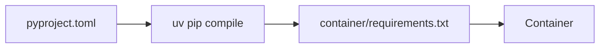

<!-- SPDX-License-Identifier: Apache-2.0 -->
# LamaDist Tooling Guide

This document describes the tools required for LamaDist development, how to set up your environment, and how to use the build system.

## Table of Contents

- [Overview](#overview)
- [Required Tools](#required-tools)
- [Developer Environment Setup](#developer-environment-setup)
- [mise Task Reference](#mise-task-reference)
- [Container Python Dependencies](#container-python-dependencies)
- [KAS Configuration](#kas-configuration)
- [Troubleshooting](#troubleshooting)
- [Transition Note](#transition-note)

---

## Overview

LamaDist uses a containerized build approach to ensure reproducible builds across different development environments. The core tools are:

- **mise**: Single CLI entrypoint — polyglot tool/runtime manager and task runner ([mise.jdx.dev](https://mise.jdx.dev/))
- **podman** (preferred) or Docker: Provides the isolated, reproducible KAS build container
- **KAS**: Declarative Yocto/OE project setup and build tool (runs inside the container)
- **uv** + `pyproject.toml`: Python dependency management inside the container
- **GitVersion**: Automatic semantic versioning

Host developers only need **`mise`**, **`podman`** (or Docker), and **`git`**. No Python, venv, or Make is required on the host — mise manages any needed tools.

---

## Required Tools

### Host System Requirements

**Operating System**: Linux (Ubuntu 22.04 LTS recommended) or WSL2

**Minimum Hardware**:
- CPU: 4+ cores (8+ recommended)
- RAM: 8 GB minimum (16+ GB recommended)
- Disk: 100+ GB free space (SSD strongly recommended)
- Internet: For downloading sources and dependencies

### Core Tools

#### 1. mise

**Purpose**: Polyglot tool manager and task runner — single CLI entrypoint for all development tasks

**Installation**: See the [mise Getting Started guide](https://mise.jdx.dev/getting-started.html) for the latest instructions.

```bash
# Install mise (one-liner)
curl https://mise.run | sh

# Add mise to your shell (follow the output instructions, e.g. for bash):
echo 'eval "$(~/.local/bin/mise activate bash)"' >> ~/.bashrc
source ~/.bashrc

# Verify installation
mise --version
```

#### 2. podman (preferred) or Docker

**Purpose**: Run the KAS build container for reproducible Yocto builds

**podman Installation (Ubuntu/Debian)**:
```bash
sudo apt-get update
sudo apt-get install -y podman

# Verify installation
podman --version
```

**Docker Alternative**: Docker 20.10+ with BuildKit is also supported. See [Docker documentation](https://docs.docker.com/) for installation.

#### 3. Git

**Required Version**: 2.25+

**Installation**:
```bash
sudo apt-get install -y git

# Configure Git (replace with your information)
git config --global user.name "Your Name"
git config --global user.email "your.email@example.com"
```

### Optional Tools

#### GitVersion

**Purpose**: Automatic semantic versioning from Git history

```bash
# GitVersion runs in a container, no local installation needed
mise run version
```

#### Development Tools

For enhanced development experience:

```bash
# Code editors
sudo snap install code --classic  # VS Code

# Useful utilities
sudo apt-get install -y \
  vim \
  tmux \
  htop \
  tree \
  jq
```

---

## Developer Environment Setup

### Quick Start

```bash
# Clone the repository
git clone https://github.com/lamawithonel/lamadist.git
cd lamadist

# Install tools (mise manages everything)
mise install

# Build image (2-6 hours on first build)
mise run build --bsp x86_64

# Images will be in: build/tmp/deploy/images/genericx86-64/
```

### Detailed Setup

#### Environment Variables

LamaDist uses environment variables for build configuration:

**.kas.env**: Environment variables passed to KAS container
- See `.kas.env` file for available variables
- Contains container/CI environment passthrough

**.kas.env.local**: Local overrides (not committed to git)
```bash
# Create local environment overrides
cat > .kas.env.local << 'EOF'
# Example: Set download directory
DL_DIR=/path/to/shared/downloads

# Example: Set shared state mirror
SSTATE_MIRRORS=file://.* http://my-sstate-server/PATH;downloadfilename=PATH

# Example: Limit CPU usage
BB_NUMBER_THREADS=4
PARALLEL_MAKE=-j 4
EOF
```

#### Build Cache Configuration

**Shared State Cache**: Cache of built packages
```bash
# Default location: .cache/sstate/
# Override with environment variable
export HOST_SSTATE_DIR=/path/to/sstate
```

**Download Directory**: Source tarballs
```bash
# Set in .kas.env.local
DL_DIR=/path/to/downloads
```

### Build Output Locations

After a successful build:

```
build/
├── downloads/              # Source tarballs
├── tmp/
│   ├── deploy/
│   │   ├── images/        # Final images (WIC, qcow2, etc.)
│   │   ├── rpm/           # RPM packages
│   │   └── licenses/      # License manifests
│   └── work/              # Build work directories
├── buildhistory/          # Build history tracking
└── buildstats/            # Build statistics
```

**Image files**:
- `build/tmp/deploy/images/<machine>/`
  - `*.wic.zst`: Compressed disk image
  - `*.ext4`: Root filesystem
  - `*.qcow2`: QEMU virtual machine image
  - `*.manifest`: Package list
  - `*.rootfs.json`: SPDX SBOM

---

## mise Task Reference

mise is the single CLI entrypoint for all LamaDist development tasks. Tasks use [`usage`](https://usage.jdx.dev/) specs for shell autocompletion of flags and arguments.

### Build Tasks

| Task | Description |
|------|-------------|
| `mise run build --bsp <bsp>` | Build images for specified BSP (default: x86_64) |
| `mise run ci-build` | Build with CI settings (force checkout, update) |
| `mise run container` | Build the KAS build container image |

**Available BSPs**: `x86_64`, `orin-nx`, `rk1`, `soquartz`

**Examples**:
```bash
mise run build --bsp x86_64    # Build x86_64
mise run build --bsp rk1       # Build for RK1
mise run ci-build              # CI-style build
mise run container             # Rebuild container
```

### Development Tasks

| Task | Description |
|------|-------------|
| `mise run shell --bsp <bsp>` | Interactive KAS shell for specified BSP |
| `mise run container-shell` | Shell in container (without KAS) |
| `mise run dump --bsp <bsp>` | Dump KAS configuration for specified BSP |

**Examples**:
```bash
# Start interactive KAS shell
mise run shell --bsp x86_64

# Dump configuration to review
mise run dump --bsp x86_64
```

**In KAS shell**:
```bash
# You're in a BitBake environment
bitbake core-image-minimal          # Build an image
bitbake -c cleansstate <recipe>     # Clean a recipe
bitbake -e <recipe>                 # Show recipe environment
bitbake-layers show-layers          # List layers
bitbake-layers show-recipes         # List recipes
```

### Cleanup Tasks

| Task | Description |
|------|-------------|
| `mise run clean` | Remove build output artifacts |
| `mise run clean:all` | Remove entire build directory (with confirmation) |
| `mise run clean:sstate` | Clean shared state cache (with confirmation) |
| `mise run clean:container` | Remove container image |

**Examples**:
```bash
# Clean outputs only (keep sstate)
mise run clean

# Full clean (will prompt for confirmation)
mise run clean:all

# Clean sstate cache
mise run clean:sstate
```

### Utility Tasks

| Task | Description |
|------|-------------|
| `mise run version` | Show build version (via GitVersion) |
| `mise tasks` | List all available tasks (built into mise) |

**Examples**:
```bash
# Get version
mise run version

# List all tasks
mise tasks
```

---

## Container Python Dependencies

Inside the build container, Python dependencies are managed with **`uv`** and **`pyproject.toml`**:



- **`pyproject.toml`**: High-level Python dependency specifications
- **`container/requirements.txt`**: Locked, compiled dependencies generated by `uv pip compile pyproject.toml`
- The **host does NOT need Python** — all Python tooling runs inside the container

---

## KAS Configuration

### KAS Overview

KAS (Setup tool for bitbake based projects) provides declarative configuration for Yocto builds.

**Benefits**:
- Reproducible builds
- Version-controlled configuration
- Easy composition of features
- No manual setup of `bblayers.conf` or `local.conf`

### Configuration Structure

```
kas/
├── main.kas.yml              # Base configuration
├── bsp/                      # BSP-specific configs
│   ├── x86_64.kas.yml
│   ├── orin-nx.kas.yml
│   ├── rk1.kas.yml
│   └── soquartz.kas.yml
├── extras/                   # Optional features
│   └── debug.kas.yml
└── installer.kas.yml         # Installer image config
```

### KAS Configuration Composition

KAS configs can be layered using `:` separator:

```bash
# Base + BSP
kas build main.kas.yml:bsp/x86_64.kas.yml

# Base + BSP + Debug
kas build main.kas.yml:bsp/x86_64.kas.yml:extras/debug.kas.yml

# Via mise (automatically includes debug)
mise run build --bsp x86_64
```

### Key KAS Configuration Elements

#### main.kas.yml

- Defines repositories (layers)
- Sets distribution (`lamadist`)
- Configures shared `local_conf_header` settings
- Specifies default branch (`scarthgap`)

#### BSP configs (bsp/*.kas.yml)

- Set `machine` variable
- Add BSP-specific repositories
- Define build targets
- Add machine-specific `local_conf_header` settings

#### Extras (extras/*.kas.yml)

- Optional feature overlays
- Debug settings
- Development tools
- Testing configurations

### Customizing KAS Configuration

To add local customizations without modifying tracked files:

1. **Create local KAS config**:
   ```yaml
   # kas/local.kas.yml (add to .gitignore)
   header:
     version: 15
   
   local_conf_header:
     my_custom_config: |
       # Custom BitBake configuration
       BB_NUMBER_THREADS = "8"
       PARALLEL_MAKE = "-j 8"
   ```

2. **Use in builds**:
   ```bash
   # (The exact syntax will depend on mise task implementation)
   mise run shell --bsp x86_64
   kas build main.kas.yml:bsp/x86_64.kas.yml:kas/local.kas.yml
   ```

---

## Troubleshooting

### Common Issues and Solutions

#### Issue: podman permission denied

**Symptom**:
```
ERRO[0000] cannot find UID/GID for user ...
```

**Solution**:
```bash
# Ensure your user has a subuid/subgid mapping
grep $USER /etc/subuid || sudo usermod --add-subuids 100000-165535 $USER
grep $USER /etc/subgid || sudo usermod --add-subgids 100000-165535 $USER

# Reset podman storage if needed
podman system reset

# Verify
podman run --rm hello-world
```

#### Issue: Docker permission denied (if using Docker)

**Symptom**:
```
docker: Got permission denied while trying to connect to the Docker daemon socket
```

**Solution**:
```bash
# Add user to docker group
sudo usermod -aG docker $USER

# Logout and login again, or:
newgrp docker

# Verify
docker ps
```

#### Issue: mise install failures

**Symptom**:
```
mise ERROR tool not found or failed to install
```

**Solution**:
```bash
# Run mise doctor for diagnostics
mise doctor

# Clear mise cache and retry
mise cache clear
mise install

# Check mise version is up to date
mise self-update
```

#### Issue: Out of disk space

**Symptom**:
```
ERROR: No space left on device
```

**Solution**:
```bash
# Check disk usage
df -h

# Clean old build artifacts
mise run clean

# Clean sstate cache (will rebuild on next build)
mise run clean:sstate

# Prune container images
podman system prune -a   # or: docker system prune -a
```

#### Issue: Build fails with hash mismatch

**Symptom**:
```
ERROR: Checksum mismatch!
```

**Solution**:
```bash
# Clear downloads and sstate
rm -rf build/downloads/<failing-package>*
rm -rf .cache/sstate/*<failing-package>*

# Retry build
mise run build --bsp x86_64
```

#### Issue: Container build fails

**Symptom**:
```
ERROR: failed to solve: failed to fetch...
```

**Solution**:
```bash
# Clear container build cache
podman system prune -a   # or: docker builder prune -a

# Rebuild container
mise run container
```

#### Issue: KAS cannot find layer

**Symptom**:
```
ERROR: Layer 'meta-xxx' is not in the collection
```

**Solution**:
```bash
# Update kas configuration to fetch all layers
mise run ci-build

# Or manually in kas shell
mise run shell --bsp x86_64
bitbake-layers show-layers  # Verify all layers present
```

### Performance Optimization

#### Speed Up Builds

1. **Use SSD**: Store build directory on SSD
2. **Increase parallelism**:
   ```bash
   # In .kas.env.local
   BB_NUMBER_THREADS=<cpu_cores>
   PARALLEL_MAKE=-j <cpu_cores * 1.5>
   ```
3. **Use shared sstate cache**: Point to network sstate mirror
4. **Use shared download directory**: Reuse downloads across workspaces
5. **Enable Icecream** (distributed compilation):
   ```bash
   # In .kas.env.local
   ICECC_DISABLED=0
   ```

#### Reduce Disk Usage

1. **Clean old builds regularly**: `mise run clean`
2. **Limit sstate cache size**: Use `sstate-cache-management` script
3. **Share downloads**: Use `DL_DIR` on separate partition

### Getting More Information

#### Check BitBake logs

```bash
# Main BitBake log
less build/tmp/log/cooker/<machine>/<timestamp>.log

# Task logs
less build/tmp/work/<arch>/<recipe>/<version>/temp/log.do_<task>.<pid>
```

#### Debug in KAS shell

```bash
# Enter KAS shell
mise run shell --bsp x86_64

# Run BitBake with debugging
bitbake -D core-image-minimal

# Show dependencies
bitbake -g core-image-minimal
```

---

## Transition Note

> **Note:** The existing `Makefile` remains functional during the transition period. The `mise` tasks described in this document are the target state and will be implemented via `.mise.toml` in a follow-up PR. During the transition, you may use either `make` or `mise run` commands. The `Makefile` and `Pipfile` will be removed once all mise tasks are validated and Phase 0.3 exit criteria are met.

---

## Additional Resources

### Documentation
- [Yocto Project Documentation](https://docs.yoctoproject.org/)
- [KAS Documentation](https://kas.readthedocs.io/)
- [BitBake User Manual](https://docs.yoctoproject.org/bitbake/)
- [mise Documentation](https://mise.jdx.dev/)

### Community
- [Yocto Project Mailing Lists](https://lists.yoctoproject.org/)
- [Yocto Project Discord](https://discord.gg/yocto)

### Tools
- [mise](https://mise.jdx.dev/)
- [podman Documentation](https://docs.podman.io/)
- [uv Documentation](https://docs.astral.sh/uv/)
- [GitVersion Documentation](https://gitversion.net/)

