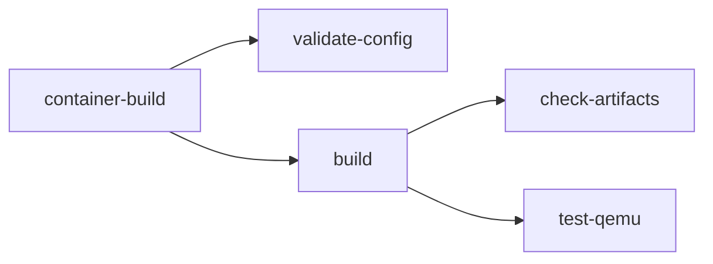

<!-- SPDX-License-Identifier: Apache-2.0 -->
# LamaDist Tooling Guide

This document describes the tools required for LamaDist development, how to set up your environment, and how to use the build system.

## Table of Contents

- [Overview](#overview)
- [Required Tools](#required-tools)
- [Developer Environment Setup](#developer-environment-setup)
- [mise Task Reference](#mise-task-reference)
- [mise Paranoid Mode](#mise-paranoid-mode)
- [Container Python Dependencies](#container-python-dependencies)
- [KAS Configuration](#kas-configuration)
- [Troubleshooting](#troubleshooting)

---

## Overview

LamaDist uses a containerized build approach to ensure reproducible builds across different development environments. The core tools are:

- **mise**: Single CLI entrypoint — polyglot tool/runtime manager and task runner ([mise.jdx.dev](https://mise.jdx.dev/))
- **podman** (preferred) or Docker: Provides the isolated, reproducible KAS build container
- **KAS**: Declarative Yocto/OE project setup and build tool (runs inside the container)
- **uv** + `pyproject.toml`: Python dependency management inside the container
- **GitVersion**: Automatic semantic versioning

Host developers only need **`mise`**, **`podman`** (or Docker), and **`git`**. No Python, venv, or Make is required on the host — mise manages any needed tools.

---

## Required Tools

### Host System Requirements

**Operating System**: Linux (Ubuntu 22.04 LTS recommended) or WSL2

**Minimum Hardware**:
- CPU: 4+ cores (8+ recommended)
- RAM: 8 GB minimum (16+ GB recommended)
- Disk: 100+ GB free space (SSD strongly recommended)
- Internet: For downloading sources and dependencies

### Core Tools

#### 1. mise

**Purpose**: Polyglot tool manager and task runner — single CLI entrypoint for all development tasks

**Installation**: See the [mise Getting Started guide](https://mise.jdx.dev/getting-started.html) for the latest instructions.

```bash
# Install mise (one-liner)
curl https://mise.run | sh

# Add mise to your shell (follow the output instructions, e.g. for bash):
echo 'eval "$(~/.local/bin/mise activate bash)"' >> ~/.bashrc
source ~/.bashrc

# Verify installation
mise --version
```

#### 2. podman (preferred) or Docker

**Purpose**: Run the KAS build container for reproducible Yocto builds

**podman Installation (Ubuntu/Debian)**:
```bash
sudo apt-get update
sudo apt-get install -y podman

# Verify installation
podman --version
```

**Docker Alternative**: Docker 20.10+ with BuildKit is also supported. See [Docker documentation](https://docs.docker.com/) for installation.

#### 3. Git

**Required Version**: 2.25+

**Installation**:
```bash
sudo apt-get install -y git

# Configure Git (replace with your information)
git config --global user.name "Your Name"
git config --global user.email "your.email@example.com"
```

### Optional Tools

#### GitVersion

**Purpose**: Automatic semantic versioning from Git history

```bash
# GitVersion runs in a container, no local installation needed
mise run version
```

#### Development Tools

For enhanced development experience:

```bash
# Code editors
sudo snap install code --classic  # VS Code

# Useful utilities
sudo apt-get install -y \
  vim \
  tmux \
  htop \
  tree \
  jq
```

---

## Developer Environment Setup

### Quick Start

```bash
# Clone the repository
git clone https://github.com/lamawithonel/lamadist.git
cd lamadist

# Trust the mise config (required for MISE_PARANOID=1 users)
mise trust

# Install tools (mise manages everything)
mise install

# Build image (2-6 hours on first build)
mise run build --bsp x86_64

# Images will be in: build/tmp/deploy/images/genericx86-64/
```

### Detailed Setup

#### Environment Variables

LamaDist uses environment variables for build configuration:

**.kas.env**: Environment variables passed to KAS container
- See `.kas.env` file for available variables
- Contains container/CI environment passthrough

**.kas.env.local**: Local overrides (not committed to git)
```bash
# Create local environment overrides
cat > .kas.env.local << 'EOF'
# Example: Set download directory
DL_DIR=/path/to/shared/downloads

# Example: Set shared state mirror
SSTATE_MIRRORS=file://.* http://my-sstate-server/PATH;downloadfilename=PATH

# Example: Limit CPU usage
BB_NUMBER_THREADS=4
PARALLEL_MAKE=-j 4
EOF
```

#### Build Cache Configuration

**Shared State Cache**: Cache of built packages
```bash
# Default location: .cache/sstate/
# Override with environment variable
export LAMADIST_HOST_SSTATE_DIR=/path/to/sstate
```

**Download Directory**: Source tarballs
```bash
# Set in .kas.env.local
DL_DIR=/path/to/downloads
```

### Build Output Locations

After a successful build:

```
build/
├── downloads/              # Source tarballs
├── tmp/
│   ├── deploy/
│   │   ├── images/        # Final images (WIC, qcow2, etc.)
│   │   ├── rpm/           # RPM packages
│   │   └── licenses/      # License manifests
│   └── work/              # Build work directories
├── buildhistory/          # Build history tracking
└── buildstats/            # Build statistics
```

**Image files**:
- `build/tmp/deploy/images/<machine>/`
  - `*.wic.zst`: Compressed disk image
  - `*.ext4`: Root filesystem
  - `*.qcow2`: QEMU virtual machine image
  - `*.manifest`: Package list
  - `*.rootfs.json`: SPDX SBOM

---

## mise Task Reference

mise is the single CLI entrypoint for all LamaDist development tasks. Tasks use [`usage`](https://usage.jdx.dev/) specs for shell autocompletion of flags and arguments.

### Build Tasks

| Task | Description |
|------|-------------|
| `mise run build --bsp <bsp>` | Build images for specified BSP (default: x86_64) |
| `mise run ci-build` | Build the distribution in CI mode |
| `mise run ci-validate-config` | Validate KAS configuration without building |
| `mise run ci-check-artifacts` | Validate build artifacts exist and are well-formed |
| `mise run ci-test-qemu` | Boot test build artifacts with QEMU | Build with CI settings (force checkout, update) |
| `mise run container` | Build the KAS build container image |

**Available BSPs**: `x86_64`, `orin-nx`, `rk1`, `soquartz`

**Examples**:
```bash
mise run build --bsp x86_64    # Build x86_64
mise run build --bsp rk1       # Build for RK1
mise run ci-build              # CI-style build
mise run container             # Rebuild container
```

### Development Tasks

| Task | Description |
|------|-------------|
| `mise run shell --bsp <bsp>` | Interactive KAS shell for specified BSP |
| `mise run container-shell` | Shell in container (without KAS) |
| `mise run dump --bsp <bsp>` | Dump KAS configuration for specified BSP |

**Examples**:
```bash
# Start interactive KAS shell
mise run shell --bsp x86_64

# Dump configuration to review
mise run dump --bsp x86_64
```

**In KAS shell**:
```bash
# You're in a BitBake environment
bitbake core-image-minimal          # Build an image
bitbake -c cleansstate <recipe>     # Clean a recipe
bitbake -e <recipe>                 # Show recipe environment
bitbake-layers show-layers          # List layers
bitbake-layers show-recipes         # List recipes
```

### Cleanup Tasks

| Task | Description |
|------|-------------|
| `mise run clean` | Remove build output artifacts |
| `mise run clean:all` | Remove entire build directory (with confirmation) |
| `mise run clean:sstate` | Clean shared state cache (with confirmation) |
| `mise run clean:container` | Remove container image |

**Examples**:
```bash
# Clean outputs only (keep sstate)
mise run clean

# Full clean (will prompt for confirmation)
mise run clean:all

# Clean sstate cache
mise run clean:sstate
```

### Utility Tasks

| Task | Description |
|------|-------------|
| `mise run version` | Show build version (via GitVersion) |
| `mise tasks` | List all available tasks (built into mise) |

**Examples**:
```bash
# Get version
mise run version

# List all tasks
mise tasks
```

---

## mise Paranoid Mode

LamaDist's `.mise.toml` is fully compatible with
[mise paranoid mode](https://mise.jdx.dev/paranoid.html) (`MISE_PARANOID=1`).

### What is Paranoid Mode?

Paranoid mode is an optional mise security setting that tightens how config
files are handled:

- **All** config files must be explicitly trusted before mise will load them
  (not just files that set env vars or use templates).
- Config files are **hashed** — any edit requires re-trusting.
- Community plugins cannot be installed by short-name; a full Git URL is
  required.

Enable it globally:

```bash
# via environment variable (add to your shell profile)
export MISE_PARANOID=1

# or via mise setting
mise settings set paranoid 1
```

### GitHub Actions CI

### Workflow Overview

LamaDist uses GitHub Actions for continuous integration. Due to the resource-intensive
nature of Yocto builds (large disk, RAM, and build time), the CI pipeline requires a
**self-hosted runner** for build and test jobs.

The CI workflow is defined in `.github/workflows/ci.yml` and consists of these jobs:



1. **container-build** — Build the build container image
2. **validate-config** — Validate KAS configuration via `kas dump`
3. **build** — Full distribution build via `mise run ci-build`
4. **check-artifacts** — Validate build output (WIC image, kernel)
5. **test-qemu** — Boot the image in QEMU and verify login prompt

### Workflow File

Create `.github/workflows/ci.yml` with the following content:

```yaml
---
name: CI

on:
  push:
    branches: [main]
  pull_request:
    branches: [main]
  workflow_dispatch:

permissions:
  contents: read

concurrency:
  group: ci-${{ github.ref }}
  cancel-in-progress: ${{ github.event_name == 'pull_request' }}

jobs:
  container-build:
    name: Build Container
    runs-on: [self-hosted, linux, lamadist]
    timeout-minutes: 30
    steps:
      - name: Checkout
        uses: actions/checkout@v4

      - name: Install mise
        uses: jdx/mise-action@v2

      - name: Build container image
        run: mise run container

  validate-config:
    name: Validate KAS Config
    needs: container-build
    runs-on: [self-hosted, linux, lamadist]
    timeout-minutes: 10
    steps:
      - name: Checkout
        uses: actions/checkout@v4

      - name: Install mise
        uses: jdx/mise-action@v2

      - name: Validate configuration
        run: mise run ci-validate-config

  build:
    name: Build Distribution
    needs: container-build
    runs-on: [self-hosted, linux, lamadist]
    timeout-minutes: 480
    steps:
      - name: Checkout
        uses: actions/checkout@v4

      - name: Install mise
        uses: jdx/mise-action@v2

      - name: Build
        run: mise run ci-build

      - name: Upload artifacts
        uses: actions/upload-artifact@v4
        with:
          name: build-artifacts-${{ github.sha }}
          path: build/tmp/deploy/images/
          retention-days: 7

  check-artifacts:
    name: Validate Artifacts
    needs: build
    runs-on: [self-hosted, linux, lamadist]
    timeout-minutes: 10
    steps:
      - name: Checkout
        uses: actions/checkout@v4

      - name: Download artifacts
        uses: actions/download-artifact@v4
        with:
          name: build-artifacts-${{ github.sha }}
          path: build/tmp/deploy/images/

      - name: Install mise
        uses: jdx/mise-action@v2

      - name: Validate artifacts
        run: mise run ci-check-artifacts

  test-qemu:
    name: QEMU Boot Test
    needs: build
    runs-on: [self-hosted, linux, lamadist]
    timeout-minutes: 15
    steps:
      - name: Checkout
        uses: actions/checkout@v4

      - name: Download artifacts
        uses: actions/download-artifact@v4
        with:
          name: build-artifacts-${{ github.sha }}
          path: build/tmp/deploy/images/

      - name: Install mise
        uses: jdx/mise-action@v2

      - name: QEMU boot test
        run: mise run ci-test-qemu
```

### Self-Hosted Runner Setup

GitHub-hosted runners lack sufficient resources for Yocto builds.  A self-hosted
runner is required with the following specifications.

#### Host Requirements

| Resource | Minimum | Recommended |
|----------|---------|-------------|
| CPU      | 4 cores | 8+ cores    |
| RAM      | 16 GB   | 32+ GB      |
| Disk     | 100 GB free | 200+ GB SSD |
| OS       | Linux (x86_64) | Fedora 40+, Ubuntu 24.04+ |

Required host packages:

- `podman` ≥ 4.4 (Quadlet support)
- `qemu-system-x86_64` and `qemu-img`
- `git`
- `curl`
- `container-selinux` (if SELinux is enforcing)

#### Runner Installation with Podman Quadlet

The self-hosted runner is managed as a native systemd service using a
[Podman Quadlet](https://docs.podman.io/en/latest/markdown/podman-systemd.unit.5.html)
`.container` unit.  Quadlet translates a declarative `.container` file into a
full systemd service — no `podman-compose` or hand-written `ExecStart` is needed.

##### 1. Create a system service user

Use a **system** user with no login shell.  The home directory is placed under
`/var/lib` to keep service state out of `/home`:

```sh
sudo useradd \
  --system \
  --home-dir /var/lib/github-runner \
  --create-home \
  --shell /usr/sbin/nologin \
  github-runner;
```

##### 2. Provision `subuid`/`subgid` ranges

Rootless Podman requires subordinate UID/GID mappings for the service user:

```sh
sudo usermod --add-subuids 200000-265535 github-runner;
sudo usermod --add-subgids 200000-265535 github-runner;
```

##### 3. Create the cache directory

The `sstate` cache directory is configurable via the `GITHUB_RUNNER_CACHE_DIR`
environment variable and defaults to `/var/cache/github-runner`:

```sh
GITHUB_RUNNER_CACHE_DIR="${GITHUB_RUNNER_CACHE_DIR:-/var/cache/github-runner}";
sudo install -d -o github-runner -g github-runner -m 0750 \
  "${GITHUB_RUNNER_CACHE_DIR}";
```

##### 4. Create the work directory

```sh
sudo install -d -o github-runner -g github-runner -m 0750 \
  /var/lib/github-runner/_work;
```

##### 5. Write the Quadlet `.container` unit

Save as `/etc/containers/systemd/github-runner.container`:

```ini
# /etc/containers/systemd/github-runner.container
# Podman Quadlet unit for GitHub Actions self-hosted runner.
#
# After editing, reload with:
#   sudo systemctl daemon-reload
#
# Quadlet generates github-runner.service from this file.
# Debug with:
#   /usr/lib/systemd/system-generators/podman-system-generator --dryrun
#
# See: podman-systemd.unit(5)

# ---------------------------------------------------------------------------
# systemd [Unit]
# ---------------------------------------------------------------------------
[Unit]
Description=GitHub Actions Self-Hosted Runner (LamaDist)
After=network-online.target
Wants=network-online.target

# ---------------------------------------------------------------------------
# Podman [Container]
# ---------------------------------------------------------------------------
[Container]
Image=ghcr.io/actions/actions-runner:latest
ContainerName=github-runner

# --- runner configuration --------------------------------------------------
Environment=RUNNER_NAME=lamadist-builder
Environment=RUNNER_LABELS=self-hosted,linux,lamadist
Environment=RUNNER_WORKDIR=/home/runner/_work
# Set these in a drop-in or EnvironmentFile to avoid secrets in the unit:
#   RUNNER_TOKEN=<token>
#   RUNNER_REPOSITORY_URL=https://github.com/<org>/lamadist
EnvironmentFile=/var/lib/github-runner/runner.env

# --- volumes ---------------------------------------------------------------
# Work directory — runner job workspace.
Volume=/var/lib/github-runner/_work:/home/runner/_work:Z

# Shared-state cache — configurable via GITHUB_RUNNER_CACHE_DIR on the host.
# Default: /var/cache/github-runner
Volume=/var/cache/github-runner:/sstate-cache:Z

# --- user namespace --------------------------------------------------------
# Map the service user's UID into the container so bind-mounted volumes are
# readable by the in-container runner process.
UserNS=keep-id

# --- SELinux ---------------------------------------------------------------
# Volumes use :Z for private SELinux relabelling.  The default container
# SELinux type (container_t) is sufficient; override only if needed:
#
# Run the container as spc_t (super-privileged container) — disables most
# SELinux confinement.  Enable only when the runner needs host-level access
# that container_t blocks (e.g. mounting arbitrary host paths):
# SecurityLabelType=spc_t
#
# Disable SELinux labelling entirely.  Useful on systems without SELinux or
# when debugging label denials, but removes an isolation layer:
# SecurityLabelDisable=true

# --- capabilities / hardening inside the container -------------------------
# Drop all capabilities and add back only what is needed.
DropCapability=ALL
# Actions runner needs no special capabilities for most workloads.  If a
# workflow step requires e.g. CAP_NET_RAW for ping, add it here:
# AddCapability=CAP_NET_RAW

# Prevent container processes from gaining new privileges via setuid/setgid.
NoNewPrivileges=true

# Make the container root filesystem read-only.  The runner writes only to
# its work directory (bind-mounted above) and to tmpfs.  Disable if actions
# need to install packages inside the container at runtime:
# ReadOnly=true

# --- logging ---------------------------------------------------------------
LogDriver=journald

# --- auto-update -----------------------------------------------------------
# Uncomment to enable podman-auto-update(1) for automatic image pulls:
# AutoUpdate=registry

# ---------------------------------------------------------------------------
# systemd [Service] — overrides applied to the generated unit
# ---------------------------------------------------------------------------
[Service]
Restart=on-failure
RestartSec=30

# Allow time for initial image pull (15 min).
TimeoutStartSec=900

# --- systemd sandboxing ----------------------------------------------------
# These directives restrict what the *podman* process (and by extension the
# container runtime) can access on the host.  The container itself is already
# isolated by the OCI runtime; these add defence-in-depth at the systemd
# level.

# Deny writing to /usr, /boot, and /etc.
ProtectSystem=strict

# Make /home, /root, and /run/user inaccessible.  The service home is under
# /var/lib so this does not conflict.
ProtectHome=yes

# Give the service its own /tmp and /var/tmp.
PrivateTmp=yes

# Prevent loading kernel modules.
ProtectKernelModules=yes

# Make kernel tunables (/proc/sys, /sys) read-only.
ProtectKernelTunables=yes

# Protect kernel logs (/proc/kmsg, /dev/kmsg).
ProtectKernelLogs=yes

# Make cgroup filesystem read-only.
ProtectControlGroups=yes

# Hide host device nodes; only pseudo-devices (/dev/null etc.) are visible.
# Podman needs /dev/fuse when using overlay storage in rootless mode, which
# PrivateDevices=yes would hide.  Disable if builds fail with FUSE errors:
PrivateDevices=yes

# Restrict the set of system calls to a reasonable baseline.  Uses the
# @system-service pre-defined set which covers most service needs.
SystemCallFilter=@system-service

# Prevent mapping memory as both writable and executable.  Podman itself
# does not need W^X memory, but some JIT-based tools inside the container
# might.  Disable if a workflow step fails with SIGSEGV in JIT code:
MemoryDenyWriteExecute=yes

# Lock down the service personality to the native architecture only.
LockPersonality=yes

# Restrict namespace creation.  Podman must create user and mount namespaces
# to launch containers.  This allows only those two:
RestrictNamespaces=user mnt

# Limit address families to IP and UNIX sockets (Podman needs AF_NETLINK
# for network setup).  Remove AF_NETLINK only if runner jobs never create
# containers with custom networking:
RestrictAddressFamilies=AF_UNIX AF_INET AF_INET6 AF_NETLINK

# Disallow realtime scheduling.
RestrictRealtime=yes

# Prevent writes to the hardware clock.
ProtectClock=yes

# Make the hostname and machine-id appear read-only.
ProtectHostname=yes

# The following are disabled by default because they break Podman's
# container lifecycle management — enable only after testing:
#
# ProtectProc=invisible
#   Hides /proc entries for other users' processes.  May interfere with
#   conmon's PID monitoring of the container process.
#
# PrivateNetwork=yes
#   Gives the service its own network namespace with only loopback.
#   Completely breaks container networking; enable only for fully
#   offline/air-gapped runners that never pull images.
#
# PrivateUsers=yes
#   Creates a private user namespace for the service itself (in addition
#   to the one Podman creates for the container).  Can cause UID mapping
#   conflicts with rootless Podman.

# ---------------------------------------------------------------------------
# systemd [Install]
# ---------------------------------------------------------------------------
[Install]
WantedBy=multi-user.target
```

##### 6. Create the environment file

Store secrets in a file readable only by root and the service user:

```sh
sudo install -o root -g github-runner -m 0640 /dev/null \
  /var/lib/github-runner/runner.env;
```

Add the runner registration token and repository URL.  Generate
`RUNNER_TOKEN` from **Settings → Actions → Runners → New self-hosted runner**
in the GitHub repository:

```sh
sudo tee /var/lib/github-runner/runner.env > /dev/null <<'EOF'
RUNNER_TOKEN=<token>
RUNNER_REPOSITORY_URL=https://github.com/<org>/lamadist
EOF
```

##### 7. Enable and start the service

```sh
sudo systemctl daemon-reload;
sudo systemctl enable github-runner.service;
sudo systemctl start github-runner.service;
```

##### 8. Verify

```sh
sudo systemctl status github-runner.service;
sudo podman logs github-runner;
```

Check **Settings → Actions → Runners** in the GitHub repository to confirm the
runner appears online.

##### Customising the cache path

To use a non-default cache location, override the volume in a systemd drop-in:

```sh
sudo systemctl edit github-runner.service;
```

Add:

```ini
[Container]
Volume=/mnt/fast-ssd/sstate:/sstate-cache:Z
```

##### Debugging Quadlet

To preview the generated service without activating it:

```sh
/usr/lib/systemd/system-generators/podman-system-generator --dryrun;
```

To validate:

```sh
systemd-analyze --generators=true verify github-runner.service;
```

#### Alternative: Direct Runner Installation

If the containerized runner has access issues with nested `podman`, install the
runner binary directly on the host under the same system user.

##### 1. Create the system user (if not already done)

```sh
sudo useradd \
  --system \
  --home-dir /var/lib/github-runner \
  --create-home \
  --shell /usr/sbin/nologin \
  github-runner;
```

##### 2. Download and configure the runner

```sh
cd /var/lib/github-runner;
sudo -u github-runner curl -o actions-runner-linux-x64.tar.gz -L \
  https://github.com/actions/runner/releases/latest/download/actions-runner-linux-x64-2.321.0.tar.gz;
sudo -u github-runner tar xzf actions-runner-linux-x64.tar.gz;
sudo -u github-runner ./config.sh \
  --url https://github.com/<org>/lamadist \
  --token <RUNNER_TOKEN> \
  --name lamadist-builder \
  --labels self-hosted,linux,lamadist \
  --work _work;
```

##### 3. Install and start the system service

The bundled `svc.sh` creates a systemd system service that runs as the
specified user:

```sh
sudo ./svc.sh install github-runner;
sudo ./svc.sh start;
```

> **Tip:** Ensure `mise` is installed for the `github-runner` user and that
> `podman` is configured for rootless operation (`podman system migrate`
> after user creation).

## Paranoid Mode Requirements for `.mise.toml`

To avoid errors when users run mise in paranoid mode, LamaDist follows these
rules for `.mise.toml`:

1. **`mise trust` must be run** after cloning the repository and after every
   edit to `.mise.toml` (or `.mise.local.toml`). In paranoid mode the file
   contents are hashed, so any change requires re-trusting.

2. **A `min_version` is set** at the top of `.mise.toml` to guarantee that
   the running mise version supports all features used in the config.

3. **Non-standard env vars are prefixed with `LAMADIST_`** to avoid
   collisions with other tools or the user's environment. Standard
   ecosystem variables consumed by KAS or Yocto/BitBake (e.g.,
   `KAS_WORK_DIR`, `SSTATE_DIR`) keep their canonical names.

4. **Override env vars** via `.mise.local.toml` (git-ignored) or your shell
   environment. For example, to use Docker instead of Podman:

   ```toml
   # .mise.local.toml
   [env]
   LAMADIST_CONTAINER_CMD = "docker"
   ```

### Quick Setup for Paranoid Mode Users

```bash
# After cloning
cd lamadist
mise trust               # trust the config file
mise install             # install any managed tools

# After editing .mise.toml
mise trust               # re-trust after changes
```

---

## Container Python Dependencies

Inside the build container, Python dependencies are managed with **`uv`** and **`container/pyproject.toml`**:


- **`container/pyproject.toml`**: High-level Python dependency specifications (PEP 621)
- **`container/requirements.txt`**: Locked, compiled dependencies generated by `uv pip compile` during the container build
- The **host does NOT need Python** — all Python tooling runs inside the container

---

## KAS Configuration

### KAS Overview

KAS (Setup tool for bitbake based projects) provides declarative configuration for Yocto builds.

**Benefits**:
- Reproducible builds
- Version-controlled configuration
- Easy composition of features
- No manual setup of `bblayers.conf` or `local.conf`

### Configuration Structure

```
kas/
├── main.kas.yml              # Base configuration
├── bsp/                      # BSP-specific configs
│   ├── x86_64.kas.yml
│   ├── orin-nx.kas.yml
│   ├── rk1.kas.yml
│   └── soquartz.kas.yml
├── extras/                   # Optional features
│   └── debug.kas.yml
└── installer.kas.yml         # Installer image config
```

### KAS Configuration Composition

KAS configs can be layered using `:` separator:

```bash
# Base + BSP
kas build main.kas.yml:bsp/x86_64.kas.yml

# Base + BSP + Debug
kas build main.kas.yml:bsp/x86_64.kas.yml:extras/debug.kas.yml

# Via mise (automatically includes debug)
mise run build --bsp x86_64
```

### Key KAS Configuration Elements

#### main.kas.yml

- Defines repositories (layers)
- Sets distribution (`lamadist`)
- Configures shared `local_conf_header` settings
- Specifies default branch (`scarthgap`)

#### BSP configs (bsp/*.kas.yml)

- Set `machine` variable
- Add BSP-specific repositories
- Define build targets
- Add machine-specific `local_conf_header` settings

#### Extras (extras/*.kas.yml)

- Optional feature overlays
- Debug settings
- Development tools
- Testing configurations

### Customizing KAS Configuration

To add local customizations without modifying tracked files:

1. **Create local KAS config**:
   ```yaml
   # kas/local.kas.yml (add to .gitignore)
   header:
     version: 15
   
   local_conf_header:
     my_custom_config: |
       # Custom BitBake configuration
       BB_NUMBER_THREADS = "8"
       PARALLEL_MAKE = "-j 8"
   ```

2. **Use in builds**:
   ```bash
   # (The exact syntax will depend on mise task implementation)
   mise run shell --bsp x86_64
   kas build main.kas.yml:bsp/x86_64.kas.yml:kas/local.kas.yml
   ```

---

## Troubleshooting

### Common Issues and Solutions

#### Issue: podman permission denied

**Symptom**:
```
ERRO[0000] cannot find UID/GID for user ...
```

**Solution**:
```bash
# Ensure your user has a subuid/subgid mapping
grep $USER /etc/subuid || sudo usermod --add-subuids 100000-165535 $USER
grep $USER /etc/subgid || sudo usermod --add-subgids 100000-165535 $USER

# Reset podman storage if needed
podman system reset

# Verify
podman run --rm hello-world
```

#### Issue: KAS permission denied reading config files

**Symptom**:
```
PermissionError: [Errno 13] Permission denied: '/0/kas/main.kas.yml'
```

This occurs when rootless podman maps the host user's UID to a different UID
inside the container.  The build container runs as `builder` (UID 1000), and
without `--userns=keep-id` the mounted project files appear owned by a
different UID, making them unreadable.

LamaDist tasks pass `--userns=keep-id` to podman automatically, matching the
upstream `kas-container` behavior.  If you see this error, ensure you are
running the latest version of the tasks.

**Workaround** (if using a custom container command):
```bash
# For podman, always pass --userns=keep-id when mounting host volumes
podman run --userns=keep-id -v /my/project:/work ...
```

#### Issue: Docker permission denied (if using Docker)

**Symptom**:
```
docker: Got permission denied while trying to connect to the Docker daemon socket
```

**Solution**:
```bash
# Add user to docker group
sudo usermod -aG docker $USER

# Logout and login again, or:
newgrp docker

# Verify
docker ps
```

#### Issue: OCI permission denied with VirtualBox installed

**Symptom**:
```
Error: crun: creating `/dev/vboxusb/001/003`: openat2 `dev/vboxusb`: Permission denied: OCI permission denied
```

This occurs when a container bind-mounts the host `/dev` and VirtualBox USB
device nodes have restrictive permissions. LamaDist tasks do **not** mount
`/dev` (matching upstream kas-container behavior), so this should not happen.
If you see this error, ensure you are running the latest version of the
tasks.

**Workaround** (if using custom `--runtime-args`):
```bash
# Avoid mounting the entire /dev — use specific device mounts instead
# Bad:  -v /dev:/dev
# Good: --device /dev/loop-control (only when loop devices are needed)
```

#### Issue: mise install failures

**Symptom**:
```
mise ERROR tool not found or failed to install
```

**Solution**:
```bash
# Run mise doctor for diagnostics
mise doctor

# Clear mise cache and retry
mise cache clear
mise install

# Check mise version is up to date
mise self-update
```

#### Issue: BitBake server timeout

**Symptom**:
```
Timeout while waiting for a reply from the bitbake server (60s ...)
```

This occurs when BitBake's server process hangs during initialization. Common
causes inside a container:

- **Hash equivalence upstream unreachable** — if `BB_HASHSERVE_UPSTREAM` is
  set and the hostname cannot be resolved or the port is firewalled, DNS/TCP
  hangs block server startup for the full timeout period.
- **Insufficient memory** — BitBake needs several GB of RAM to parse recipes.
  Check `dmesg` or `journalctl` for OOM killer activity.
- **SSTATE_DIR mismatch** — if `local.conf` sets `SSTATE_DIR` to a path
  that is not writable, server initialization can fail silently.

**Solution**: Ensure the KAS configuration does **not** hardcode `SSTATE_DIR`
(the env var from the container mount should be used) and does not reference
unreachable external hash equivalence servers.

#### Issue: Out of disk space

**Symptom**:
```
ERROR: No space left on device
```

**Solution**:
```bash
# Check disk usage
df -h

# Clean old build artifacts
mise run clean

# Clean sstate cache (will rebuild on next build)
mise run clean:sstate

# Prune container images
podman system prune -a   # or: docker system prune -a
```

#### Issue: Build fails with hash mismatch

**Symptom**:
```
ERROR: Checksum mismatch!
```

**Solution**:
```bash
# Clear downloads and sstate
rm -rf build/downloads/<failing-package>*
rm -rf .cache/sstate/*<failing-package>*

# Retry build
mise run build --bsp x86_64
```

#### Issue: Container build fails

**Symptom**:
```
ERROR: failed to solve: failed to fetch...
```

**Solution**:
```bash
# Clear container build cache
podman system prune -a   # or: docker builder prune -a

# Rebuild container
mise run container
```

#### Issue: KAS cannot find layer

**Symptom**:
```
ERROR: Layer 'meta-xxx' is not in the collection
```

**Solution**:
```bash
# Update kas configuration to fetch all layers
mise run ci-build

# Or manually in kas shell
mise run shell --bsp x86_64
bitbake-layers show-layers  # Verify all layers present
```

### Performance Optimization

#### Speed Up Builds

1. **Use SSD**: Store build directory on SSD
2. **Increase parallelism**:
   ```bash
   # In .kas.env.local
   BB_NUMBER_THREADS=<cpu_cores>
   PARALLEL_MAKE=-j <cpu_cores * 1.5>
   ```
3. **Use shared sstate cache**: Point to network sstate mirror
4. **Use shared download directory**: Reuse downloads across workspaces
5. **Enable Icecream** (distributed compilation):
   ```bash
   # In .kas.env.local
   ICECC_DISABLED=0
   ```

#### Reduce Disk Usage

1. **Clean old builds regularly**: `mise run clean`
2. **Limit sstate cache size**: Use `sstate-cache-management` script
3. **Share downloads**: Use `DL_DIR` on separate partition

### Getting More Information

#### Check BitBake logs

```bash
# Main BitBake log
less build/tmp/log/cooker/<machine>/<timestamp>.log

# Task logs
less build/tmp/work/<arch>/<recipe>/<version>/temp/log.do_<task>.<pid>
```

#### Debug in KAS shell

```bash
# Enter KAS shell
mise run shell --bsp x86_64

# Run BitBake with debugging
bitbake -D core-image-minimal

# Show dependencies
bitbake -g core-image-minimal
```

---

## Additional Resources

### Documentation
- [Yocto Project Documentation](https://docs.yoctoproject.org/)
- [KAS Documentation](https://kas.readthedocs.io/)
- [BitBake User Manual](https://docs.yoctoproject.org/bitbake/)
- [mise Documentation](https://mise.jdx.dev/)

### Community
- [Yocto Project Mailing Lists](https://lists.yoctoproject.org/)
- [Yocto Project Discord](https://discord.gg/yocto)

### Tools
- [mise](https://mise.jdx.dev/)
- [podman Documentation](https://docs.podman.io/)
- [uv Documentation](https://docs.astral.sh/uv/)
- [GitVersion Documentation](https://gitversion.net/)

